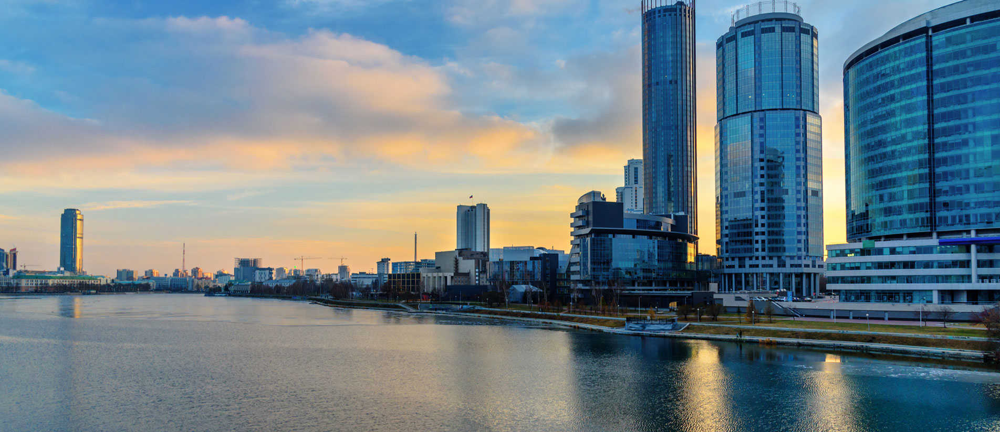
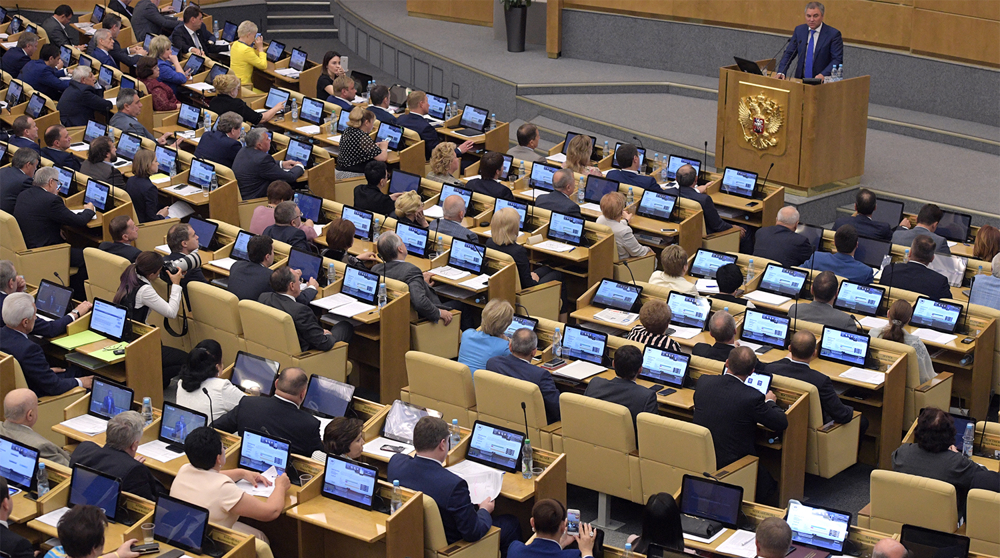
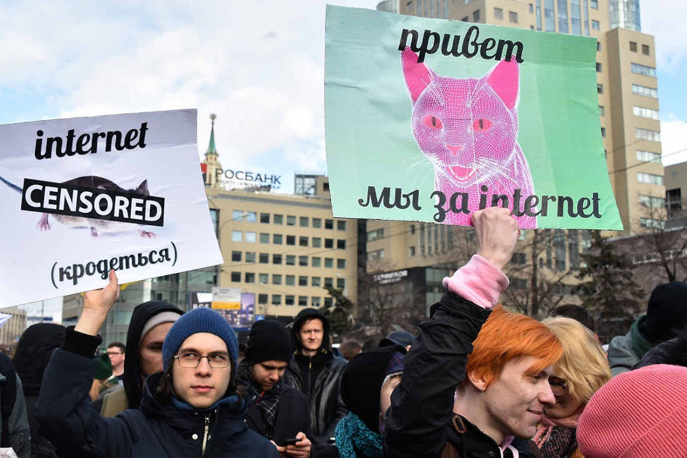
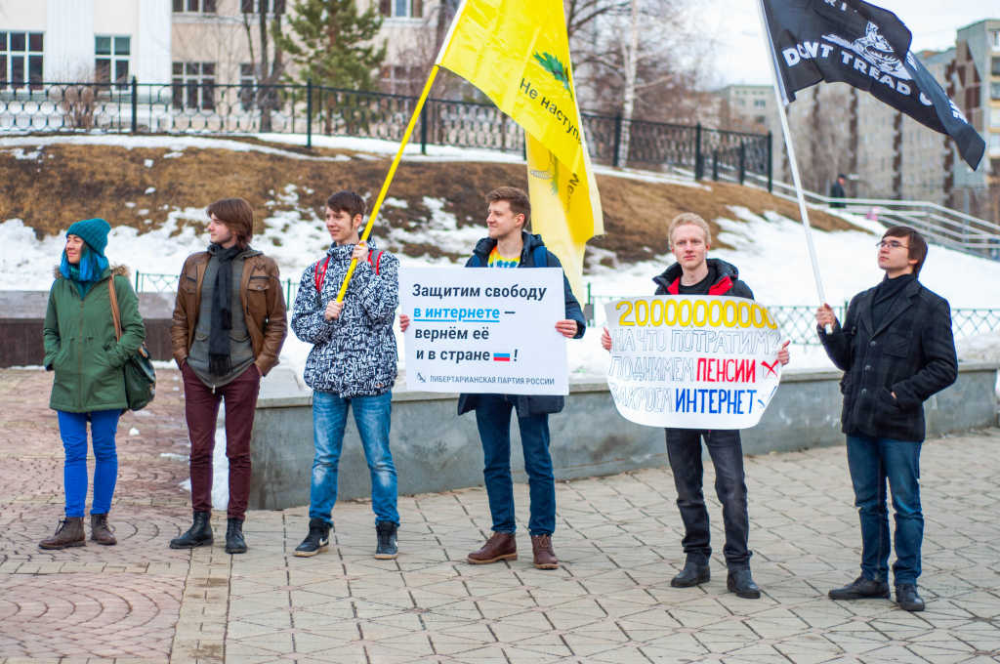

# Свободный интернет

За последние десятилетия интернет стал неотъемлемой частью нашей жизни. В интернете мы работаем, учимся, развлекаемся, покупаем товары и услуги и обмениваемся мнениями. Усилились и попытки государства контролировать то, что происходит в интернете. Государство часто оправдывает свое вмешательство соображениями безопасности и нравственности.

Либертарианцы Екатеринбурга считают, что интернет регулировать не нужно, он должен быть полностью свободной средой, а все проблемы интернета могут в частном порядке решать сами пользователи, интернет-компании и общественные организации.

## Содержание

1. [Интернет как образ жизни](#lifestyle)
2. [Что государство делает в интернете](#government)  
  2.1. [Закон о «суверенном интернете»](#isolation)  
  2.2. [Пакет Яровой](#package)  
  2.3. [Блокировка Telegram](#telegram)  
3. [Движение в защиту интернета](#protect)
4. [Интернет основан на индивидуальном выборе](#choice)
5. [Заключение](#conclusion)
6. [Источники](#sources)

<h2 id="lifestyle">Интернет как образ жизни</h2>

По данным на конец 2019 года интернетом пользуются более 78% россиян или 97 миллионов человек. Доля пользователей интернета удвоилась с 2012 года, выросла в 4 раза с 2008 и продолжает расти. Среди граждан до 30 лет интернетом пользуются почти все.

За 5 лет доля граждан, покупающих товары и услуги в интернете, удвоилась и превысила 42%. В крупных городах она составляет уже 55-60%. Объем экономики Рунета оценивается в 4,7 трлн рублей.

За 2019 год жители Свердловской области скачали 365 800 терабайт данных. Все для большего числа россиян интернет становится основным источником информации, составляя конкуренцию традиционным СМИ.

Чем глубже интернет проникает в общество, тем больше он привлекает внимание государства. Однако тем и больший ущерб государство может нанести гражданам своим неоправданным вмешательством в работу интернета. Поэтому защищать свободу интернета очень важно.

<h2 id="government">Что государство делает в интернете</h2>

<h3 id="isolation">Закон о «суверенном интернете»</h3>

В ноябре 2019 года вступил в силу закон, обязывающий интернет-провайдеров устанавливать государственное оборудование для глубокого анализа трафика на точки обмена трафиком между независимыми сетями в интернете. Также закон расширяет полномочия Роскомнадзора по управлению интернетом, например позволяет ему блокировать сайты даже без участия операторов связи.

Закон обосновывали желанием защититься от отключения России от мирового интернета — несуществующей угрозы, нереализуемой благодаря высокой связности сетей российского интернета с зарубежными сетями. Эта связность обеспечивается свободной деятельностью частных организаций без какого-либо контроля со стороны государства.

Директор «Общества защиты интернета» екатеринбуржец Михаил Климарёв убежден, что применение этого закона может привести только к снижению эффективности работы сети, уменьшению скорости интернета и увеличению его стоимости. Кроме того, закон расширяет возможности государства по цензурированию российского интернета, его централизации и потенциальной изоляции по китайскому образцу.

<h3 id="package">Пакет Яровой</h3>

В 2016 году был принят пакет законов авторства депутата госдумы от «Единой России» Ирины Яровой. Он начал действовать в 2018 году. По этим законам операторы связи должны хранить интернет-трафик пользователей в течение срока до 6 месяцев, декодировать сообщения пользователей и предоставлять ФСБ содержимое этих сообщений вместе с личными данными их авторов.

Законы принимали под лозунгами борьбы с терроризмом. Его раскритиковали совет по правам человека при президенте, министерство связи и российский союз промышленников и предпринимателей. Применение этого закона правительством потребует затрат в триллионы рублей, производства оборудования, которого нет нигде в мире, и может привести к росту цен на интернет в 12 раз и общей деградации интернет-отрасли.

«Пакет Яровой» никак не мешает преступникам пользоваться зашифрованными каналами связи, при этом ограничивает права законопослушных пользователей интернета, помогает силовикам заниматься политическим сыском и ложится бременем на российскую экономику.

<h3 id="telegram">Блокировка Telegram</h3>

Создатель мессенджера Telegram либертарианец Павел Дуров отказался выполнять требования закона Яровой передать ФСБ ключи для расшифровки переписок пользователей, назвав эти требования антиконституционными. Более того, выполнить часть требований было технически невозможно: секретные чаты Telegram используют peer-to-peer шифрование, ключи формируются на устройствах пользователей, и даже у владельцев Telegram нет возможности расшифровать их переписку.

В апреле 2018 года Роскомнадзор начал попытки заблокировать Telegram в России. Служба внесла в реестр запрещенных ресурсов почти два десятка миллионов IP-адресов, что привело к сбоям в работе многих других интернет-ресурсов и спровоцировало тысячи жалоб пользователей. Telegram при этом продолжал работать.

Снова под мнимым предлогом противодействия терроризму государство попыталось ограничить свободу собственных граждан пользоваться удобными для них сервисами в интернете и получить доступ к их переписке.

<h2 id="protect">Движение в защиту интернета</h2>

Действия государства вызвали протест значительной части российских граждан.

30 апреля 2018 года в поддержку свободного интернета и против блокирования мессенджера Telegram на митинг, организованный Либертарианской партией, вышли 11,7 тысяч человек.

В марте 2019 года на акции против закона об изоляции Рунета вышли уже по всей России, в Москве мероприятие, организованное ЛПР, собрало 16 тысяч человек. В Екатеринбурге либертарианцы вышли на пикет в защиту интернета на площади Обороны.

Либертарианцы продолжают бороться за свободу слова в интернете и запрет государственного вмешательства в его работу.

<h2 id="choice">Интернет основан на индивидуальном выборе</h2>

Интернет — среда свободного обмена информации. Любое взаимодействие в интернете добровольно: пользователь сам выбирает, с каких ресурсов получать данные и на какие отправлять; владелец ресурса — каким пользователям и какой контент отдавать, на какие другие ресурсы ссылаться.

В интернете нет границ, гражданства, государственной власти и ее произвола. Даже стандарты, по которым он работает — результат добровольных соглашений и деятельности множества частных и общественных организаций.

При этом любая цель, декларируемая государством в оправдание цензуры и слежки за пользователями, может быть при согласии этих пользователей легко достигнута: владельцы сайтов могут удалять нежелательный контент, конкурирующие провайдеры — блокировать доступ к «опасным» ресурсам, частные поисковики — убирать из выдачи неподходящие материалы, владельцы мессенджеров — отслеживать активность преступников и сообщать о них в полицию.

Современные технологии позволяют сортировать и фильтровать контент как угодно: пользователь может сознательно выбирать, что он хочет видеть в сети, а что нет. Родители способны оградить детей от угроз в интернете множеством различных способов.

<h2 id="conclusion">Заключение</h2>

Попытки государства под разными предлогами вмешиваться в работу интернета приносят только вред гражданам, которые за эти попытки платят налогами из собственного кармана.

Нужно не только защитить интернет от навязывания там порядка, господствущего в офлайне, но и распространить его принципы: свободу, открытость и добровольность — на общество, в котором мы живем.

Либертарианцы Екатеринбурга хотят такого общества, продолжат бороться за свободный интернет и призывают всех присоединяться.

<h2 id="sources">Источники</h2>

1. [Исследование GfK: Проникновение Интернета в России](https://www.gfk.com/ru/insaity/press-release/issledovanie-gfk-proniknovenie-interneta-v-rossii/)

1. [Итоги 2019 года: данные РАЭК](https://e-pepper.ru/news/itogi-goda-dannye-raek.html)

1. [Развитие онлайн-торговли в России: Исследование Яндекса](https://yandex.ru/company/researches/2019/market-gfk)

1. [E1.ru: Екатеринбург может стать цифровой столицей России](https://www.e1.ru/news/spool/news_id-66485332.html)

1. [Федеральный закон от 1 мая 2019 г. N 90-ФЗ "О внесении изменений в Федеральный закон "О связи" и Федеральный закон "Об информации, информационных технологиях и о защите информации"](https://rg.ru/2019/05/07/fz90-dok.html)

1. [Настоящее время: Приведет ли закон об изоляции рунета к цензуре в Сети](https://www.currenttime.tv/a/29884446.html)

1. [Гарант: Президент РФ подписал антитеррористический "пакет Яровой"](http://www.garant.ru/news/782190/)

1. [Коммерсант: СПЧ готовит отрицательное заключение на новые антиэкстремистские инициативы](https://www.kommersant.ru/doc/2961107)

1. [NewsRu.com: Глава Минкомсвязи признал, что из-за "пакета Яровой" связь может подорожать на 300%](https://www.newsru.com/russia/30jun2016/mincom.html)

1. [BBC: Как подорожает сотовая связь из-за "закона Яровой"](https://www.bbc.com/russian/features-44376641)

1. [ТАСС: Роскомнадзор начал процедуру блокировки Telegram](https://tass.ru/ekonomika/5129977)

1. [Meduza: Количество заблокированных Роскомнадзором IP-адресов превысило четыре миллиона](https://meduza.io/news/2018/04/17/kolichestvo-zablokirovannyh-roskomnadzorom-ip-adresov-prevysilo-dva-milliona)

1. [Meduza: На акцию протеста против блокировки Telegram в Москве собрались более 10 тысяч человек](https://meduza.io/news/2018/04/30/na-aktsiyu-protesta-protiv-blokirovki-telegram-v-moskve-sobralis-bolee-10-tysyach-chelovek)

1. [BBC: В Москве прошел митинг против изоляции рунета](https://www.bbc.com/russian/news-47514303)

1. [I'MC: Как прошел пикет против изоляции российского интернета в Екатеринбурге](https://itsmycity.ru/2019-03-23/kak-proshel-piket-protiv-izolyacii-rossijskogo-interneta)