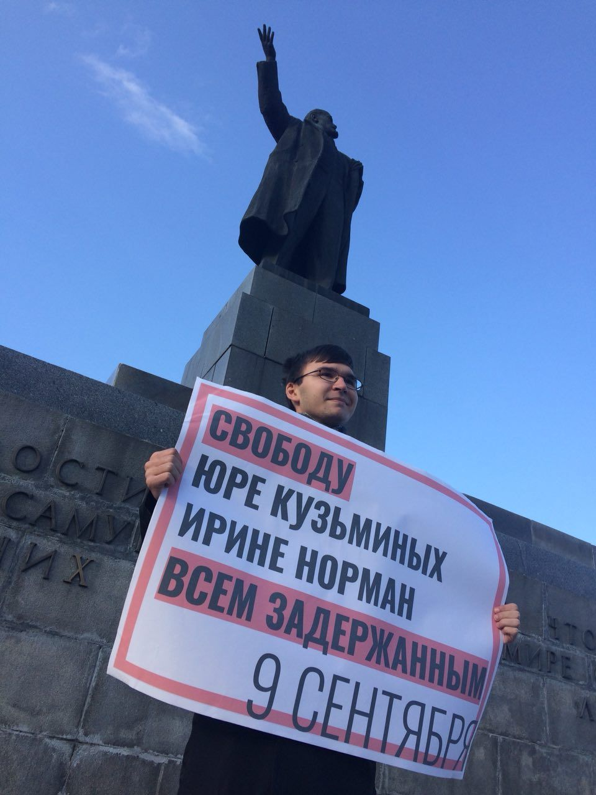
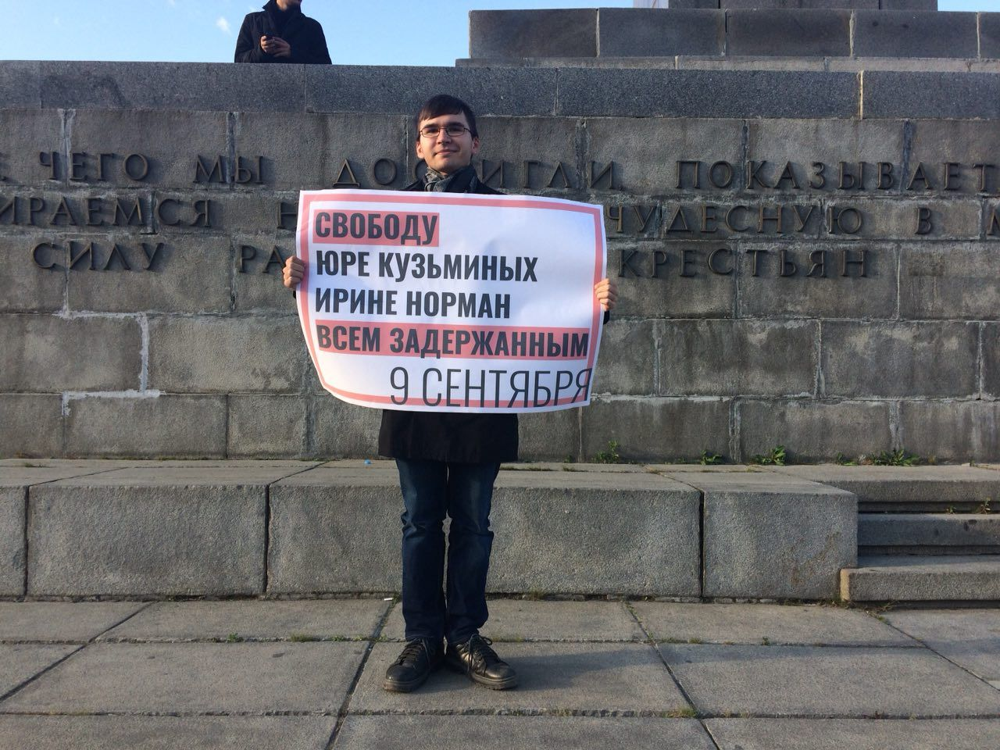
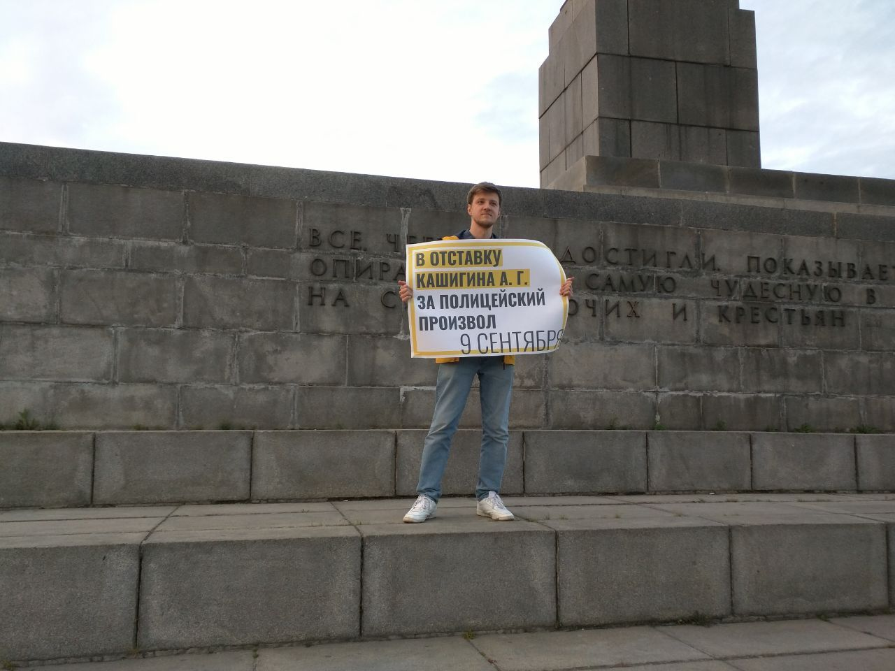
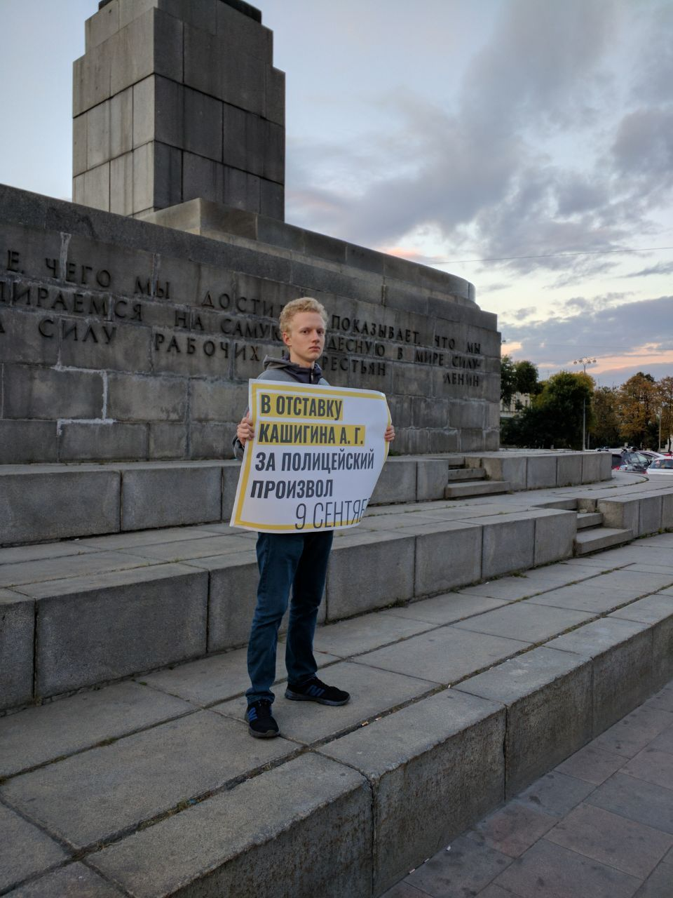
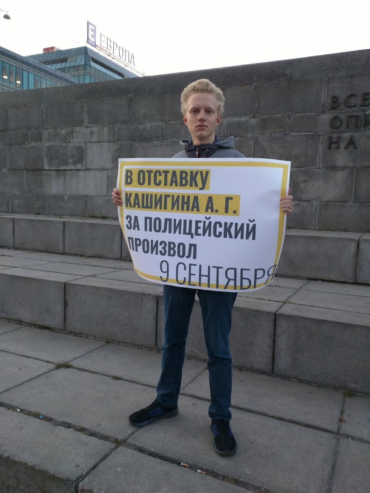

---
    date: 2018-09-19T20:42:37+00:00
...

# Либертарианцы [организовали пикеты] за освобождение задержанных

Сегодня мы устроили серию пикетов с требованием освободить секретаря РК Свердловского отделения ЛПР Юрия Кузьминых и других активистов, задержанных 9 сентября, а также отправить в отставку начальника отдела охраны общественного порядка подполковника полиции Кашигина А. Г., отдававшего приказы о незаконных задержаниях граждан.

