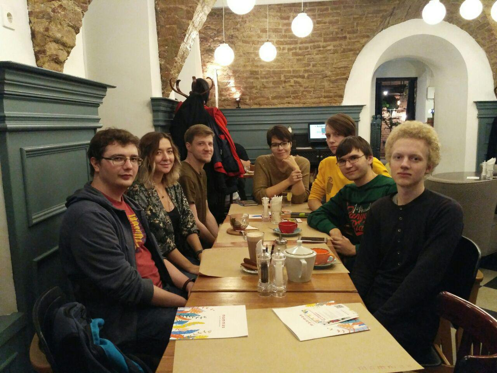
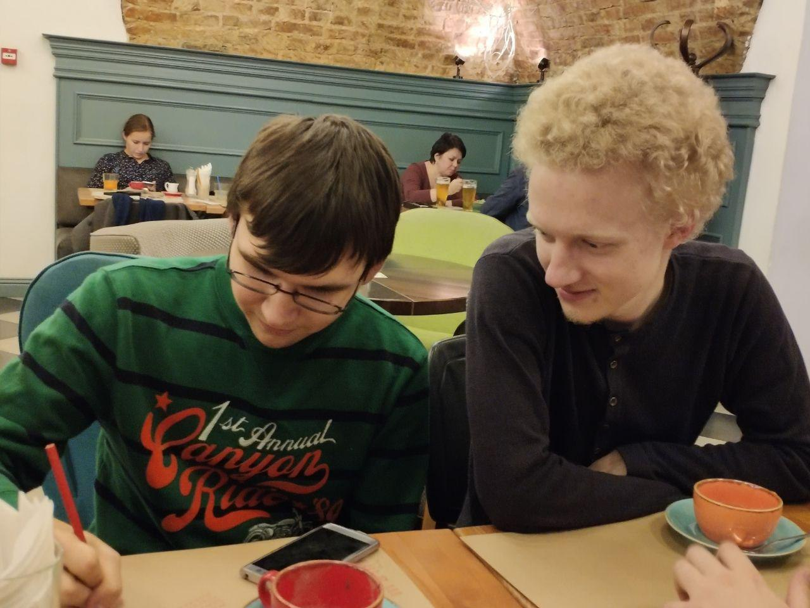
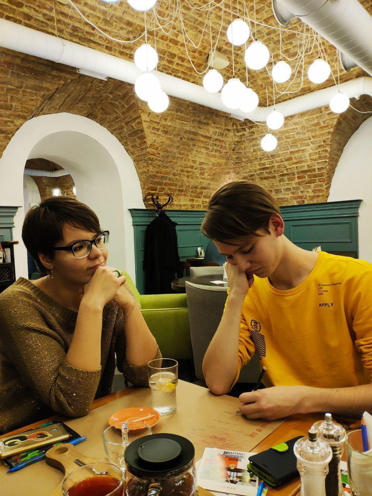
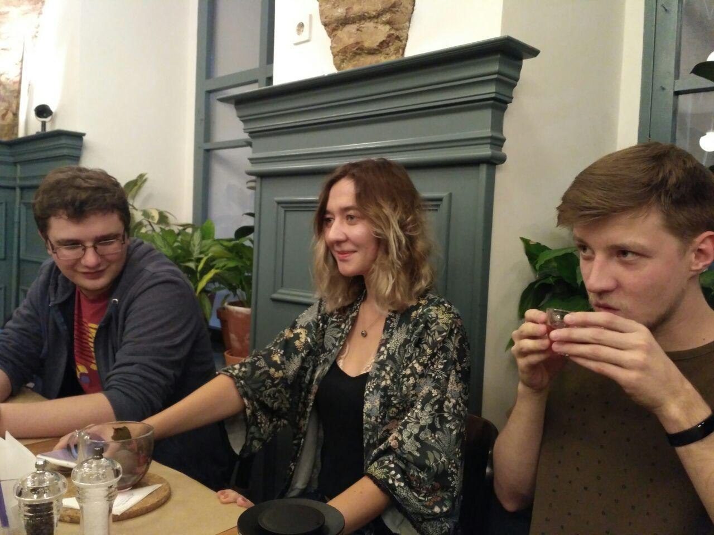
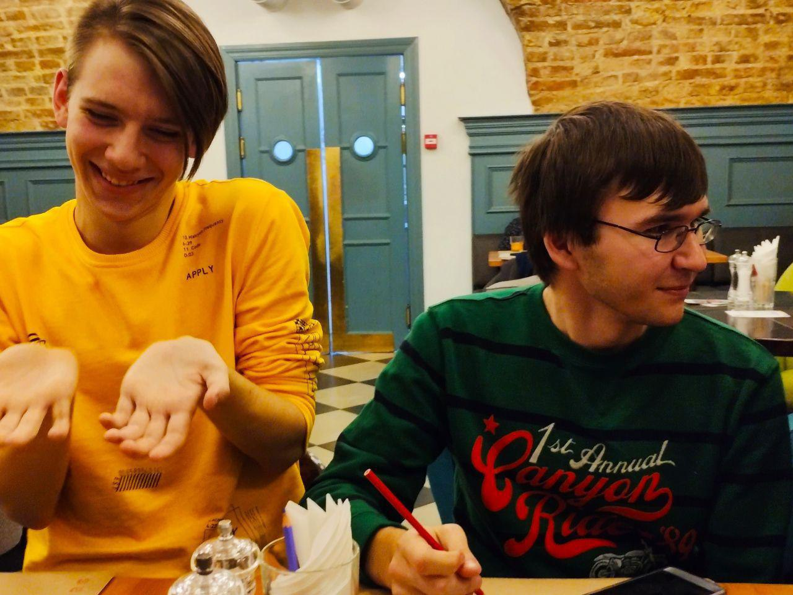

---
    date: 2018-10-25T22:17:52+00:00
...

# Либертарианцы Екатеринбурга [обсудили дальнейшие планы]

Либертарианцы Екатеринбурга собираются каждые две недели, чтобы обсудить текущие проекты партии и нагенерить идей для новых.

Вот и сегодня мы встретились и придумали:
* как попробовать вернуть свободу собраний в Екб
* кого пригласить в Екб для проведения публичной лекции
* какой фильм посмотреть на киноклубе
* на какую тему устроить внутрипартийные дебаты
* как сделать атрибутику отделения

Не обошлось без теоретических дискуссий о либертарианстве, анархизме и трансгуманизме. Запланировали активности на ближайшие две недели, среди которых поездка на Чтения Адама Смита в Москву 4 ноября.

