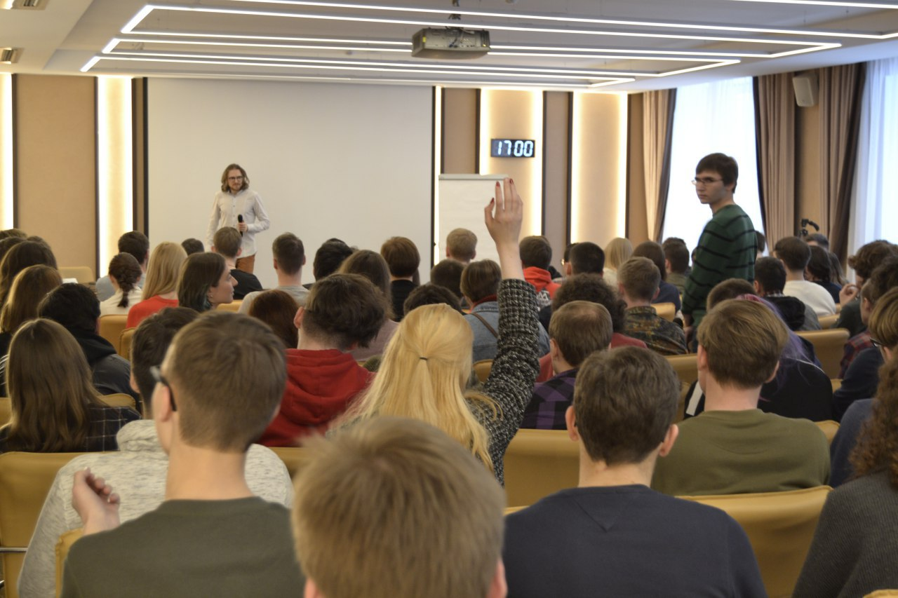

---
    date: 2019-04-29T20:19:22+00:00
...

# Лекция Михаила Светова [собрала полный зал]

Наш известный однопартиец, автор канала SVTV Михаил Светов, еще в субботу выступивший в Смоленске, вчера собрал полный зал с лекцией в Екатеринбурге.

Встретиться с Михаилом пришли 200 человек. Темой лекции стали отношения между российскими регионами и федеральным центром. Михаил отстаивал точку зрения, что сверхцентрализованное государство не дает развиваться и богатеть регионам, и решения, значительно влияющие на жизнь граждан, должны приниматься не в Москве, а на местах. Светов объяснил, почему не стоит ждать от федеральных политиков реформ, направленных на увеличение бюджетных и законодательных полномочий регионов, и предложил добиваться принятия нового федеративного договора. После часовой лекции Михаил еще 3 часа без перерыва отвечал на вопросы собравшихся.

Друзья, мы были очень рады видеть всех вас на мероприятии: свободных, смелых, здравомыслящих и неравнодушных к будущему нашей страны!

