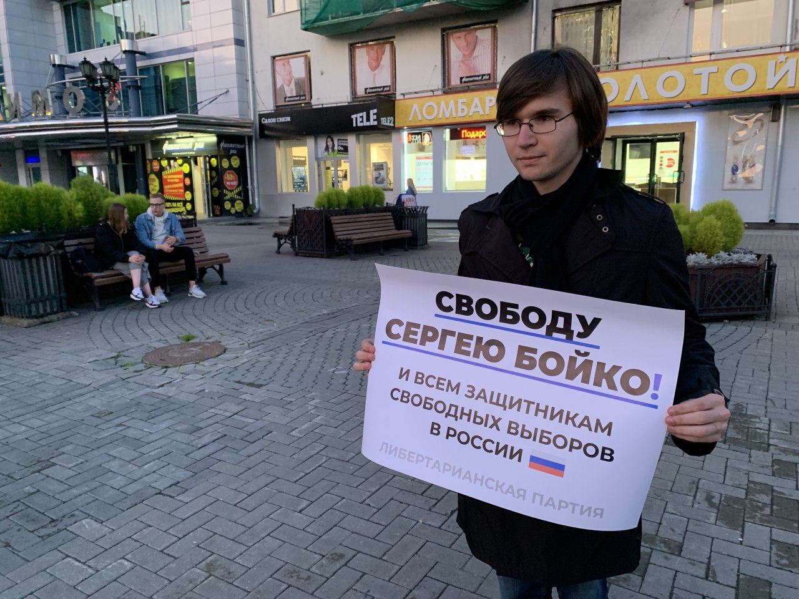
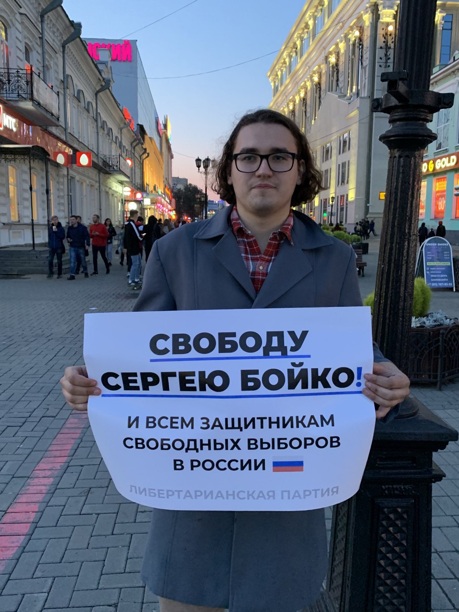
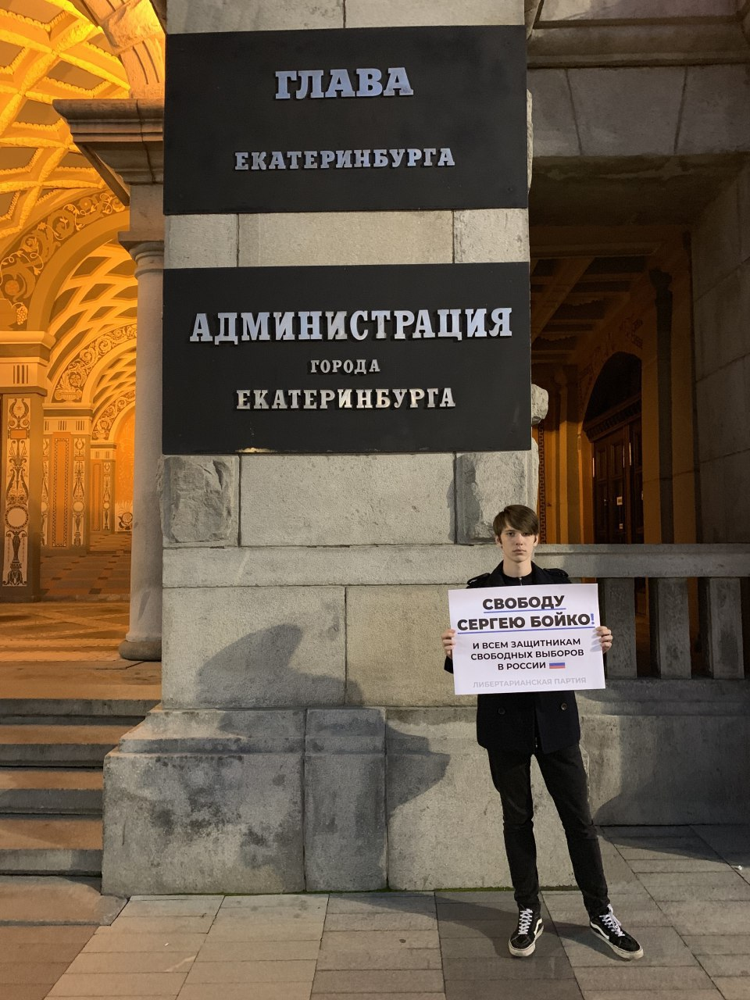
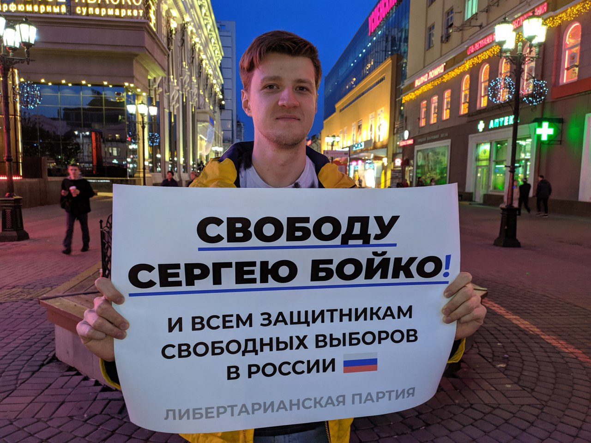

---
    date: 2019-09-06T12:49:48+00:00
...

# Либертарианцы [провели акцию] за освобождение председателя партии

Вчера члены и сторонники нашего отделения вышли в одиночные пикеты в поддержку председателя ФК ЛПР Сергея Бойко и всех, кто борется за свободные выборы в России.

Сергея арестовали на 10 суток за репост записи Любови Соболь о шествии 31 августа в Москве. Сегодня в 12:00 (время московское) в Мосгорсуде состоится апелляция по его делу.

