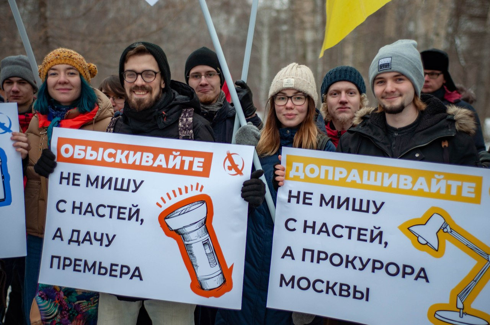
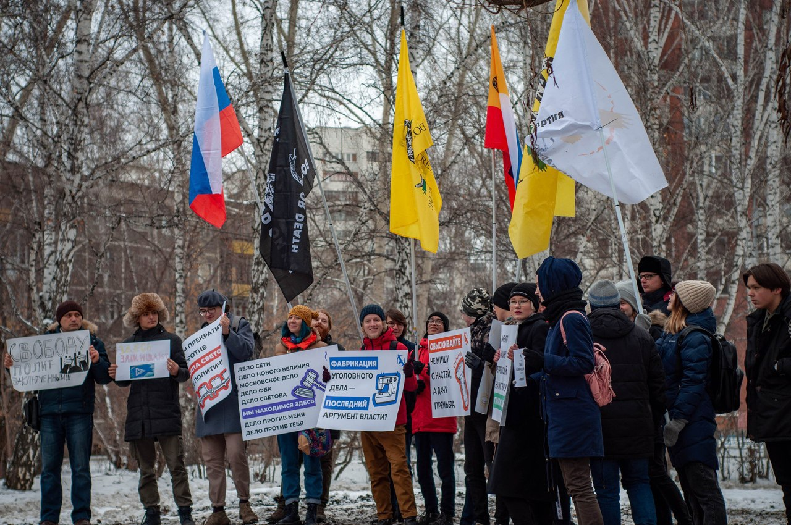
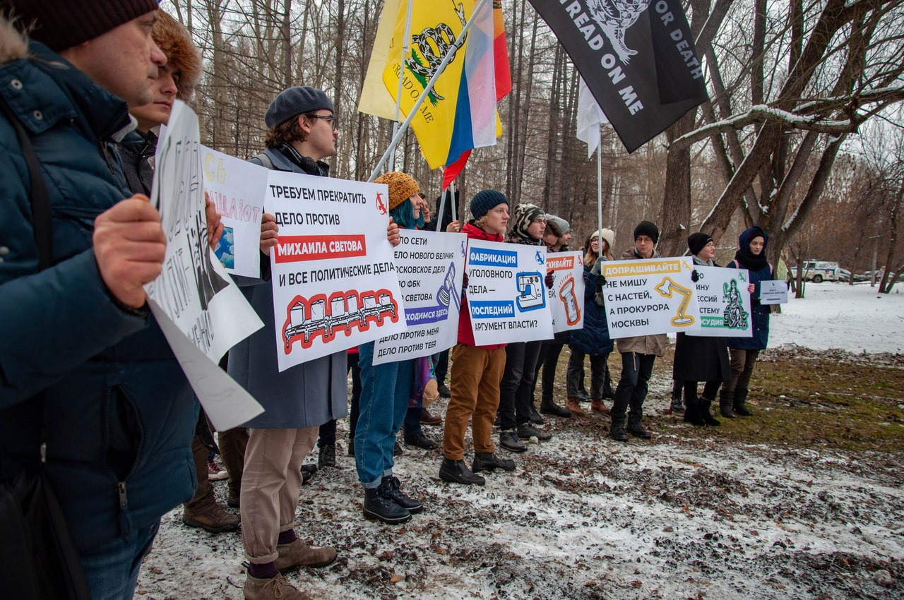
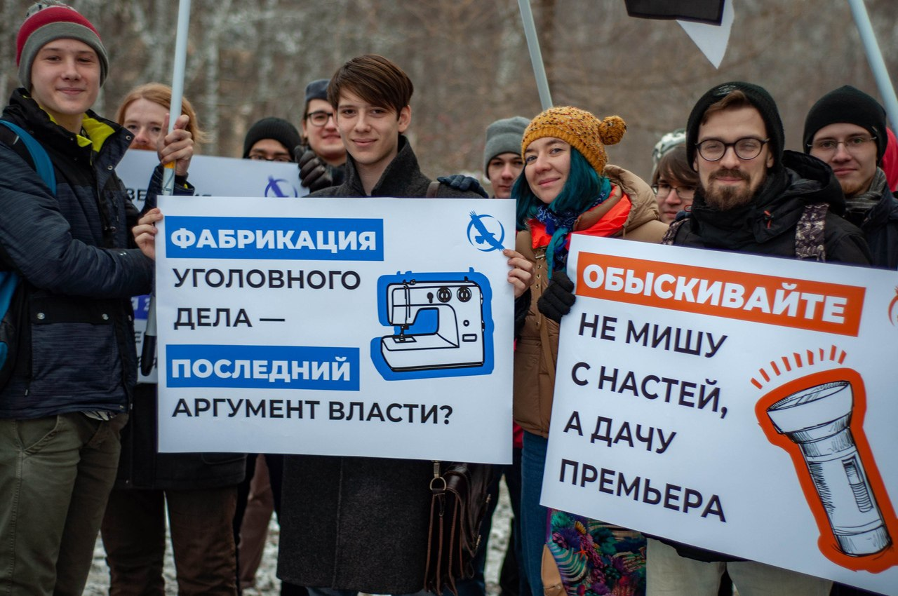
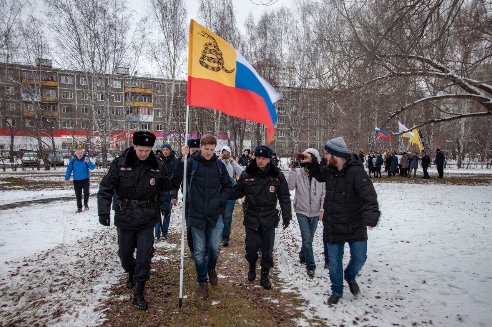
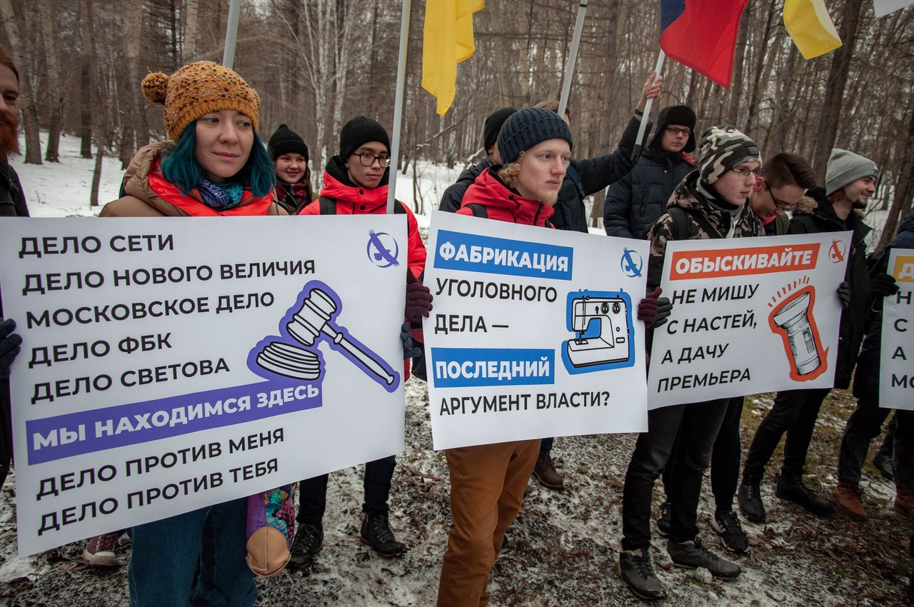
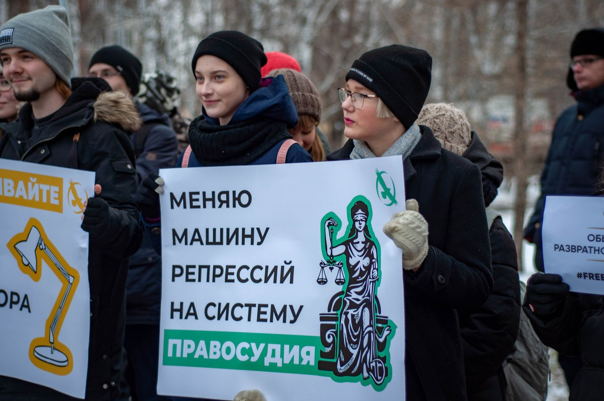

---
    date: 2019-11-17T20:36:56+00:00
...

# Либертарианцы [подвели итоги] пикета

Сегодня состоялся наш массовый пикет в рамках кампании \#FreeSvetov – многие люди пришли выступить против государственного насилия и поддержать узников путинского режима, на которых заведены политические дела.

Несмотря на то, что полицейские задержали члена нашего отделения, проявив при этом грубое незнание закона, который они призваны защищать, мы считаем пикет удачным. Мы должны и будем дальше пользоваться одним из немногих инструментов защиты друг друга от государственного произвола – публичностью.

Именно поэтому после окончания массового пикета члены Свердловского отделения пикетировали пятый отдел полиции Ленинского района. Вскоре Станислава отпустили оттуда, вменив ему 17.10, 19.3 статьи КоАП и выдав повестку на 19 ноября.

Спасибо всем, кто не промолчал и поддержал акцию. Замалчивание – путь к смерти гражданского общества.

