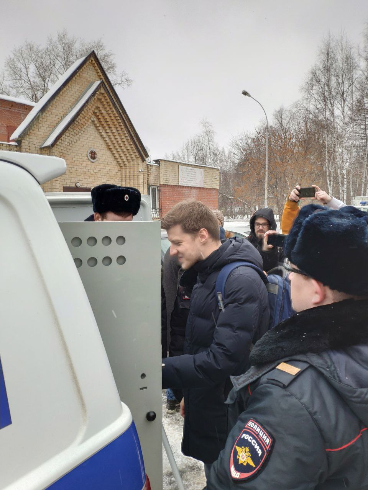

---
    date: 2019-11-17T14:25:55+00:00
...

# Полиция [задержала активиста ЛПР] за либертарианский флаг

На согласованном массовом пикете против политических репрессий в поддержку Михаила Светова только что задержали члена ЛПР Станислава Жаркова. Не угодил флаг со змеей – "оскорбление государственной символики"

Стас стоял с флагом, которые либертарианцы используют повсеместно в России, однако, на этой акции флаг по непонятным причинам стал неугоден.

Ему вменяют нарушение ФЗ о флаге, что абсолютно неприемлемо – закон гласит о нарушении правил официального использования государственного флага и применим только к органам государственной власти, официальным представителям РФ.

Станислава доставляют в 5 отдел полиции за демонстрацию флага русского либертарианства.

UPD: Стаса не задерживают, с него берут письменное объяснение с обязательством дальнейшей явки в отделение.

UPD: решения полицейских меняются с невероятной скоростью. Стаса все-таки увозят в отдел.