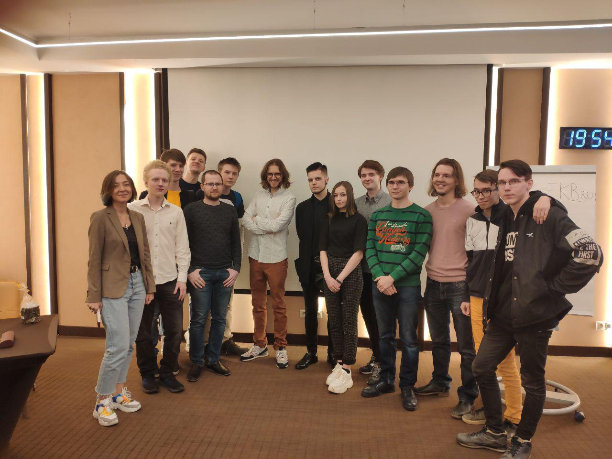

---
    date: 2019-11-07T15:42:51+00:00
...

# У Михаила Светова [прошёл обыск]

Вчера у Михаила Светова прошел обыск. Этот обыск связан с уголовным делом, которое завели за посты в Instagram семилетней давности. Сейчас о самом деле мало что известно, однако нет никаких сомнений в том, что оно связано с политической деятельностью Михаила.

Мы считаем давление со стороны СК на членов нашей партии и иных политических активистов за их гражданскую позицию неприемлемым. От лица всех членов нашего отделения выражаем поддержку Михаилу Светову. Мы готовы организовать в Екатеринбурге акции в защиту нашего однопартийца.