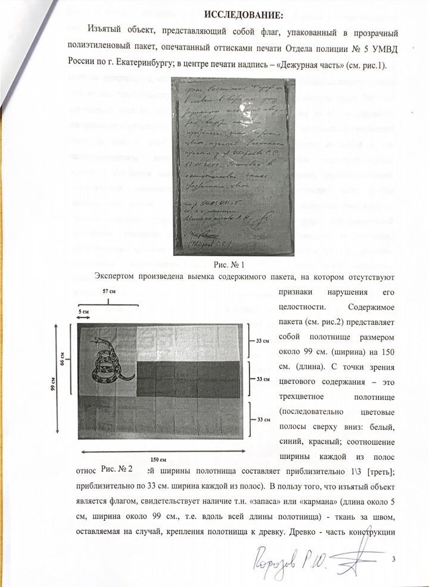
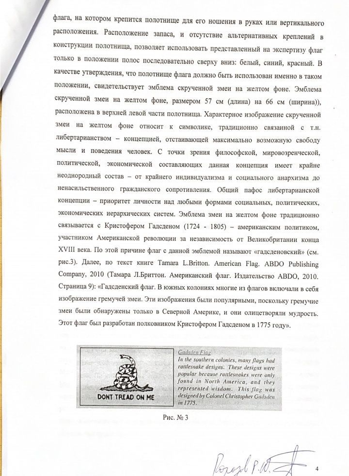
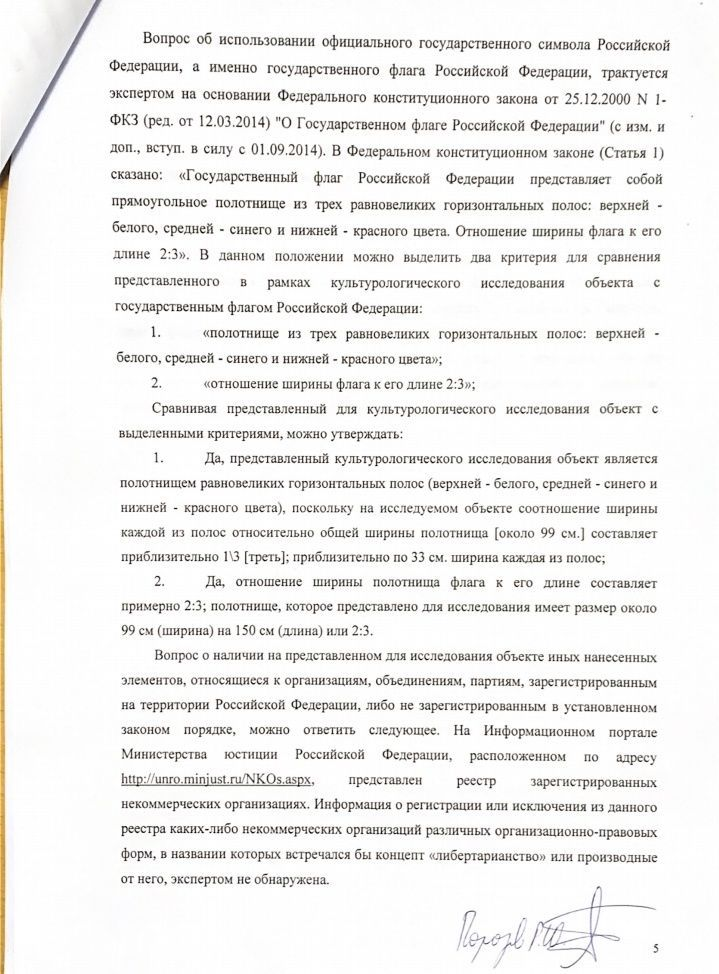
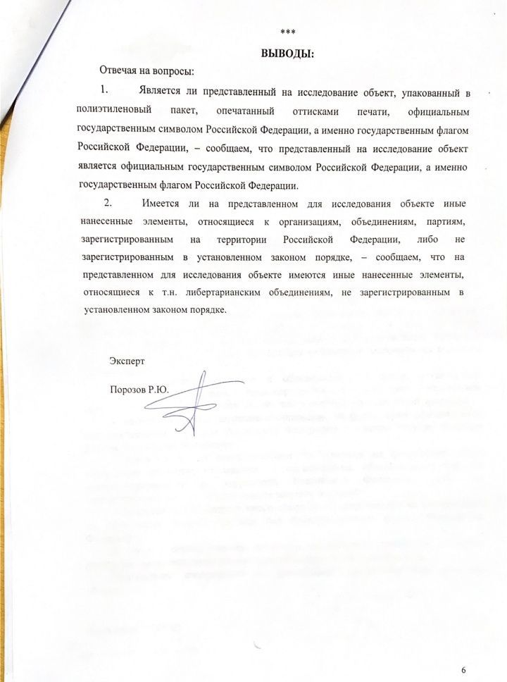

---
    date: 2019-12-10T14:47:37+00:00
...

# Полиция [провела экспертизу] либертарианского флага

У нас новости: на руках наконец-то экспертиза нашего флага, который был изъят при задержании члена ЛПР Станислава.

Экспертиза подтверждает нарушение ФЗ о флаге, что совершенно не так: использование гражданами Государственного Флага РФ, его изображения, допускается в том случае, если использование не является надругательством над ним. Таким образом, обвинение по 17.10 КоАП несостоятельно. 

Протоколы на Стаса были в итоге оформлены по 17.10 и 20.2. ч.5., а не 19.3. КоАП. Обвинение по 20.2. ч.5. оснований также не имеет, так как установленный порядок проведения акции не был нарушен Стасом, массовый пикет был согласован и проведен в месте, указанном в уведомлении. Использование флагов разрешено на таком публичном мероприятии, незаконных действий Стас не совершал. 

Значения статей искажены, мы считаем, что это сделано намеренно с целью давления на члена ЛПР в связи с его активной обществоенно-политической деятельностью. Мы напишем подробный пост о результатах экспертизы и наших дальнейших действиях.

