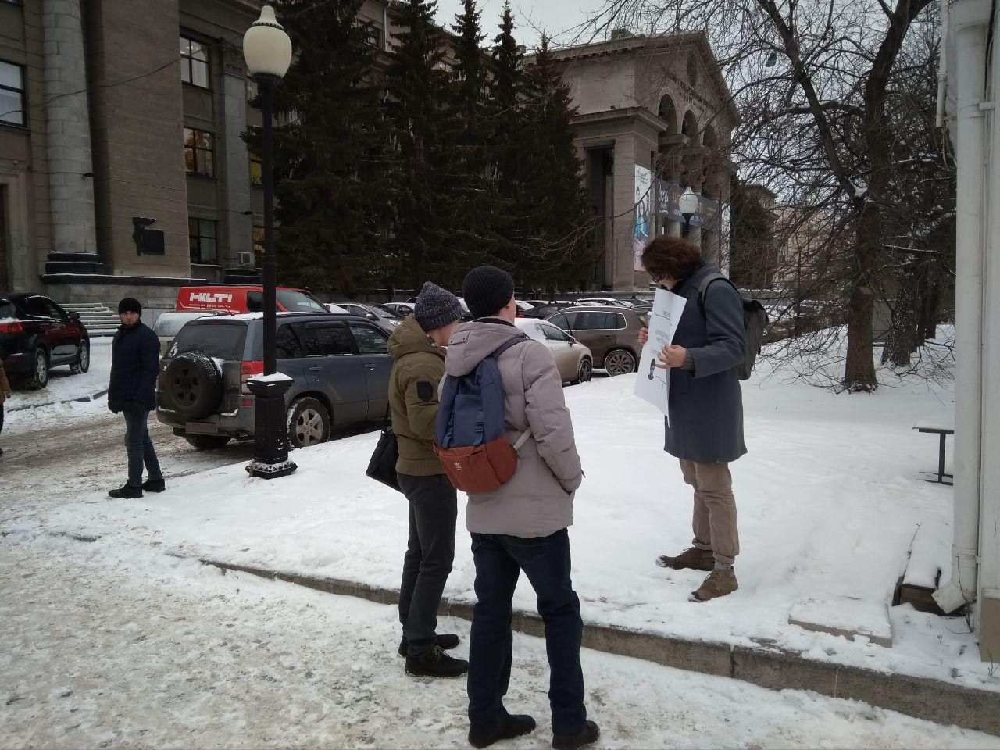
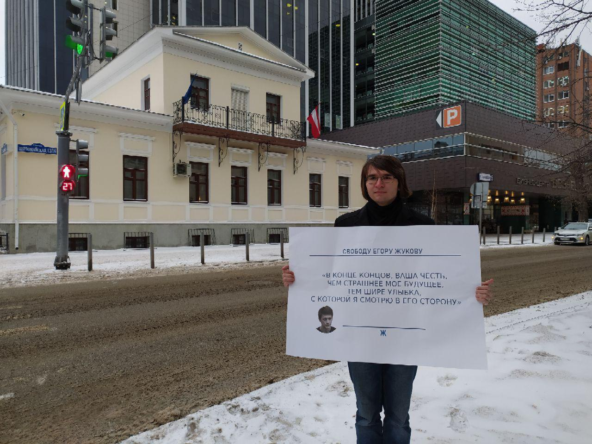
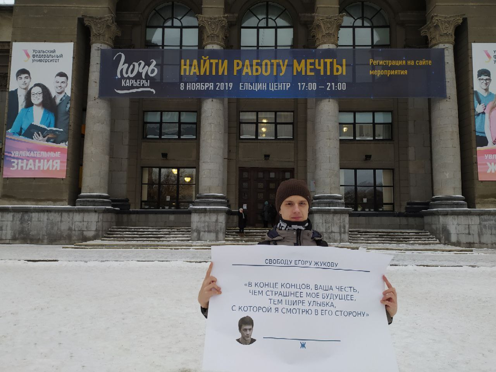

---
    date: 2019-12-06T16:00:07+00:00
...

# Либертарианцы [протестуют] против приговоров по «Московскому делу»

Сегодня в Москве настоящий судный день – суды назначили сразу шести фигурантам «Московского дела». Ни один из тех, кто сегодня под угрозой получения реального срока, не виновен.

Егор Жуков получил три года условно, гнусный вердикт, несмотря на то, что он остается на свободе. В условиях путинского режима мы вынуждены радоваться тому, что за слова человек получил условный срок, а не попал в колонию на четыре года.

Мы выдыхаем, когда Павла Новикова, признавшего вину, отпускают из зала суда, приговорив к штрафу в 120 тысяч рублей. Сотня тысяч после того, как Павел признал вину, извинился перед полицейским и выплатил ему 15 тысяч за моральный ущерб. Правосудие.

Тысячи сегодня часами стоят на холоде около судов, только благодаря широкой медийной кампании, благодаря силе гражданского общества нам удается спасать людей от нескольких лет тюремного ужаса. 

Мы сегодня пикетируем, и вы, если хотите хоть чем-то помочь преследуемым, выходите в пикеты.

