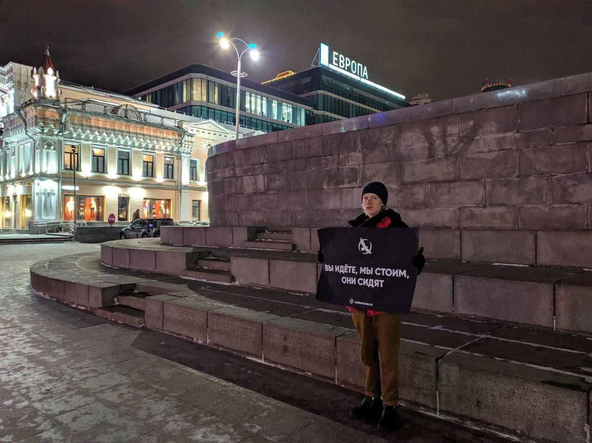
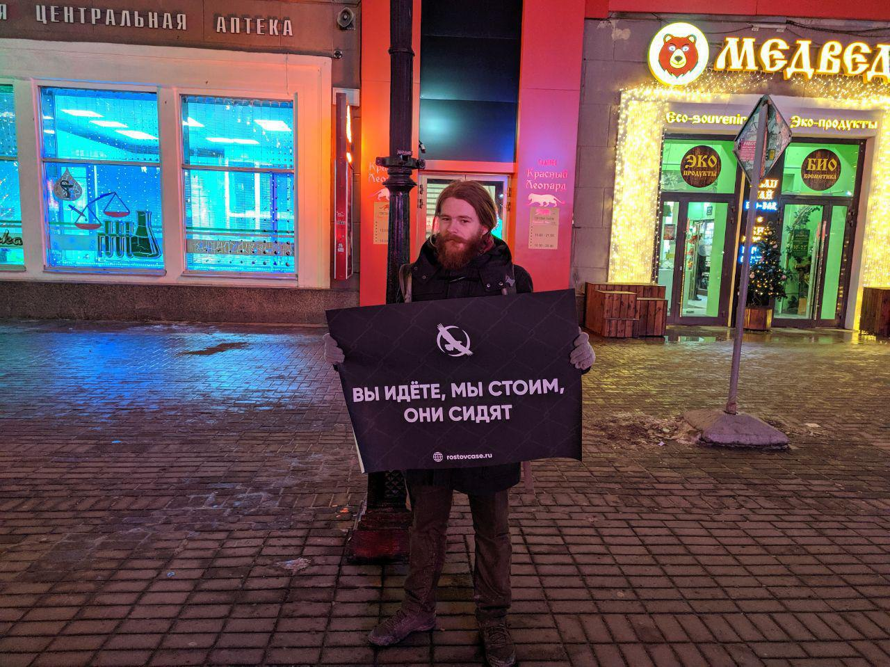

---
    date: 2019-12-11T19:26:18+00:00
...

# Либертарианцы [провели пикеты] против «Ростовского дела»

Мы тоже сядем за плакат?

Ростовское дело – уголовка за мирную акцию протеста, посвященную проблемам местных погорельцев. Яна Сидорова и Владислава Мордасова обвинили в покушении на организацию массовых беспорядков, 212 статья УК РФ.

Не было даже намека на массовые беспорядки. Ребят арестовали за неугодный властям плакат, а затем подвергли унижениям и пыткам, под давлением которых они признали свою вину. 4 октября 2019 года суд приговорил Владислава и Яна к 6 годам 7 месяцам и 6 годам 6 месяцам колонии строгого режима.

С 9 по 11 декабря мы, как и активисты десятка других городов, стояли в пикетах в поддержку узников совести, требуя их немедленного освобождения, а также привлечения силовиков к ответственности за фабрикацию дела.

В эти даты рассматривались апелляционные жалобы Сидорова и Мордасова – приговор оставили в силе. Впереди Верховный суд и ЕСПЧ, однако важнейшим фактором, который может повлиять на освобождение политзаключенных, является гласность. Кампания по «Ростовскому делу» будет продолжаться.

