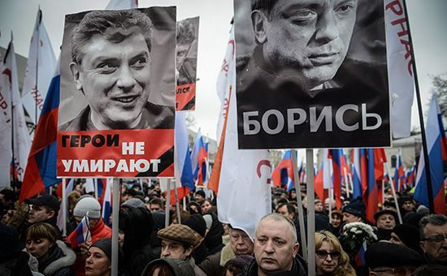

---
 date: 2020-02-26T12:00:00+05:00
...
# ЛПР [примет участие в митинге] против поправок в Конституцию

В субботу, 29 февраля, Екатеринбургское отделение ЛПР примет участие в марше и митинге, посвященному памяти Бориса Немцова и протесту против готовящихся поправок в Конституции.

Либертарианская партия, последовательно выступая против агрессивного насилия, не может забыть убийство государством собственного гражданина. Каждого, кто как и мы считает, что у государственных преступлений нет срока давности, мы призываем присоединиться к нам.

Все мероприятия согласованы. Сбор на марш начинается в 13:00 у центрального входа в ТЦ Параход по адресу Амундсена, 62. После марша, в 14:00, митинг на аллее парка Чкалова.