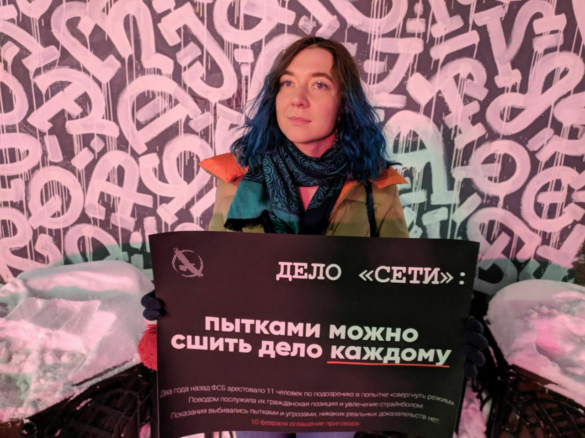
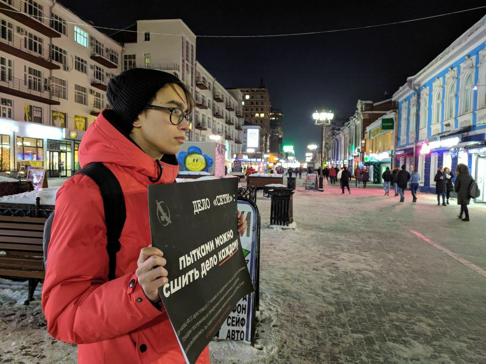
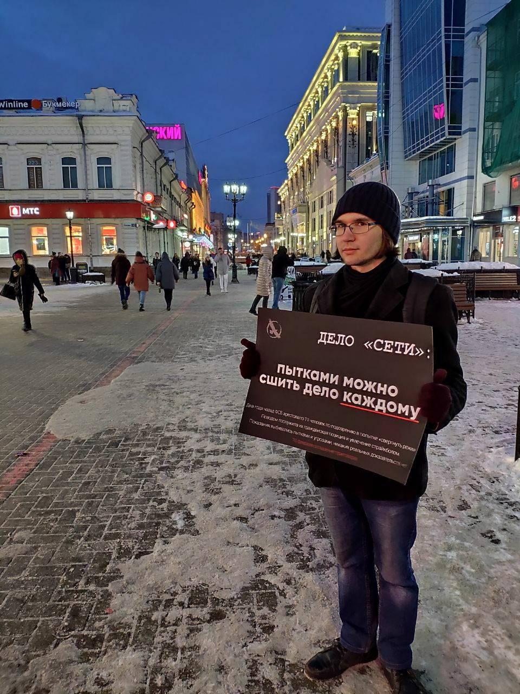

---
    date: 2020-02-18T12:00:00+05:00
...
# Либертарианцы [вышли в пикеты] против дела «Сети»

В субботу пять членов нашего отделения вышли в серию одиночных пикетов по делу "Сети". Мы, либертарианцы, выступаем против применения пыток и фальсификации уголовных дел.

В последнее время количество таких дел против "терористических организаций" возросло, что на деле означает не стремление людей к насилию, а лишь провокацию со стороны властей, желание посадить как можно больше политически активных молодых людей и дискредитировать оппозицию - как в глазах населения в целом, так и среди самих оппозиционеров, чтобы в каждом незнакомом активном человеке мы видели провокатора и потенциальную угрозу.

Но мы не должны бояться - всё это говорит о бессилии власти и дискредитирует лишь её, но не нас. Доносить правду об этих делах до людей, мыслить трезво и не молчать о творящемся произволе - вот, что мы должны делать сегодня ради прекрасной, свободной России будущего. И пусть свободная Россия - пока ещё Россия будущего, вы можете вступить в партию свободы уже сейчас. Заполнить заявление можно на [сайте партии](https://libertarian-party.ru/join). 

Россия будет свободной.