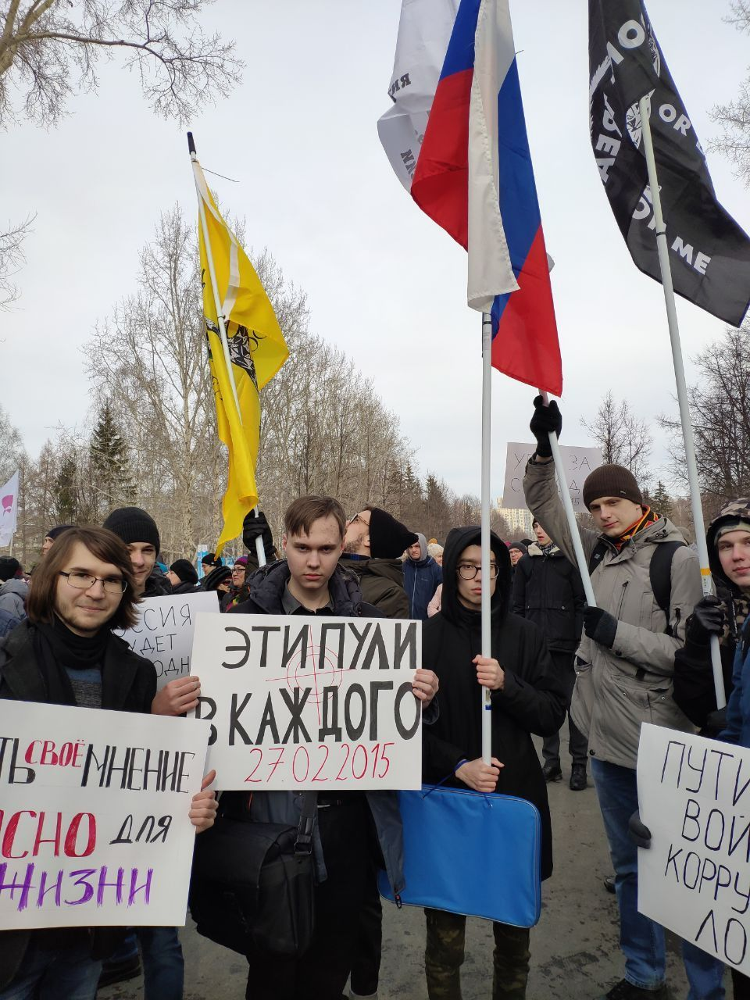

---
 date: 2020-03-01T12:00:00+05:00
...
# Либертарианцы [прошли маршем] в память Немцова

Вчера вся страна почтила память Бориса Ефимовича Немцова. Гражданина, убитого собственным государством. Политика, убитого режимом, которому он противостоял.

Екатеринбургское отделение Либертарианской партии России также не осталось в стороне. Мы прошли маршем по городу для того, чтобы вместе со всеми напомнить власти о ее преступлении, которое и спустя пять лет мы не забываем и не забудем никогда.

У преступлений этого режима нет срока давности, и поэтому, чтобы из раза в раз не наступать на одни и те же грабли, нужно помнить о всех, кто был убит и искалечен. Только тогда Россия станет свободной. Такой, какой хотел ее видеть Немцов. Такой, какой хотим ее видеть мы.