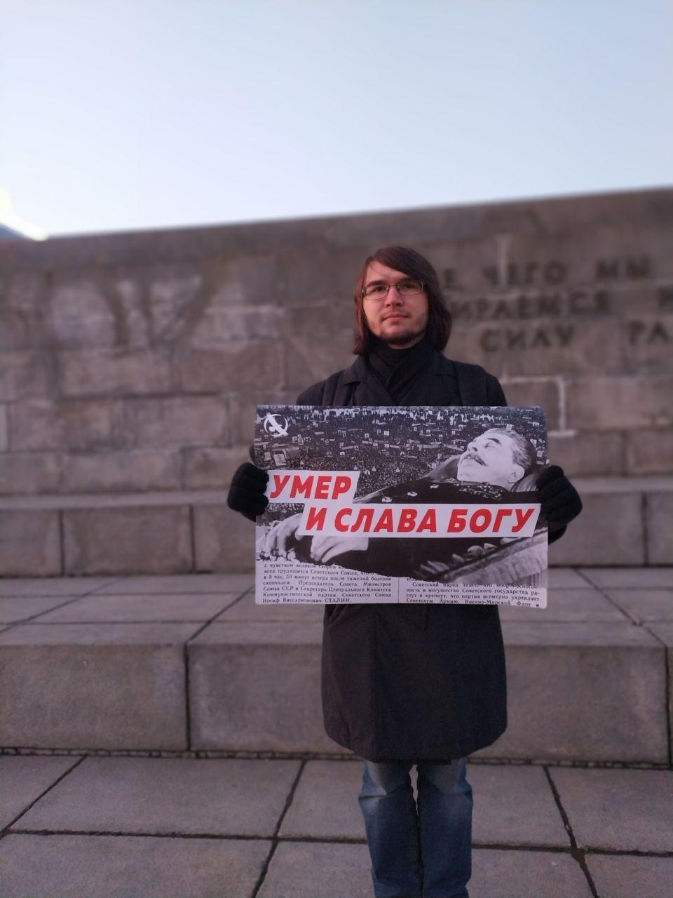
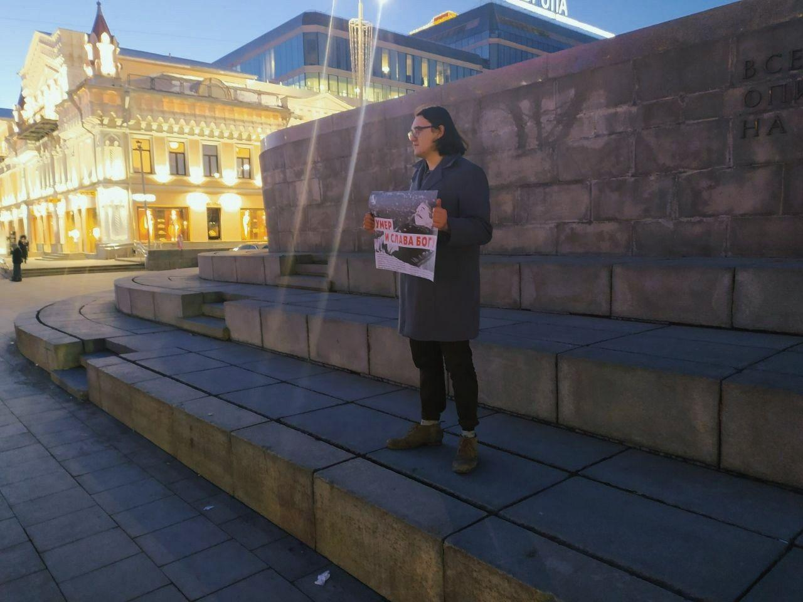

---
    date: 2020-03-05T12:00:00+05:00
...

# ЛПР [провела пикеты] в память жертв сталинизма

«Мы живем, под собою не чуя страны»

Ровно 67 лет назад умер Сталин, человек, виновный в гибели миллионов граждан России, диктатор, поставиший ее на край гибели. Каждый должен помнить об ужасах тех лет, когда, засыпая в страхе, любой человек ждал настойчивого ночного звонка в дверь, когда в лагерях от изнеможения и холода погибали сотни тысяч людей.

Сегодня мы вышли в пикет не для того, чтобы лишний раз порадоваться его смерти, а для того, чтобы напомнить о жертвах сталинизма, пострадавших от репрессий, голода, раскулачивания и всего того кошмара, что характеризует сталинскую эпоху. 

Нам пора похоронить пережитки тоталитаризма - власть не должна находиться в руках вождя.
