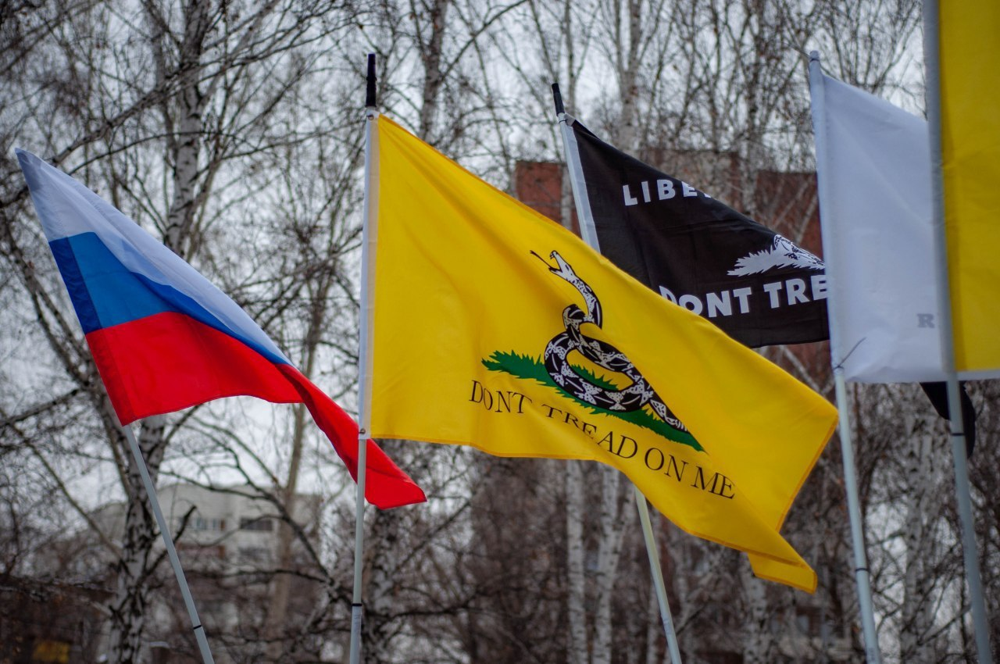

---
 date: 2020-04-15T12:00:00+05:00
...

# Либертарианской партии [исполнилось 12 лет]

Сегодня Либертарианской партии исполняется 12 лет, с чем мы сердечно поздравляем всех её членов и сторонников. На протяжении всех этих лет партия росла, взрослела, и делала она это благодаря нам с вами. Каждый из нас принимал в этом росте участие: выходил на митинги, вставал в пикеты, рассказывал о либертарианстве и партии своим друзьям и близким, организовывал партийные мероприятия.

Этот год был в целом богат на события, конкретно же Свердловское отделение организовало массовый пикет против политических репрессий, участвовало в оргкомитете шествия и митинга, приуроченных к годовщине смерти Бориса Немцова. Мы выходили в одиночные пикеты, присоединились к майским протестам против строительства храма. Что же касается внутренней жизни отделения, то в этом году мы запустили регулярно собирающийся дискуссионный клуб по самым разным либертарианским (и не только) темам. 

Хоть в ближайшее несколько месяцев и не будет возможности делать что-то подобное, мы всё равно надеемся, что к 13-летию мы сможем добиться ещё большего. Того же желаем и всем остальным отделениям и партии в целом! 

А если вы хотите стать частью нашего движения и отстаивать свободу на Урале вместе с нами, то становитесь сторонниками и подавайте заявки на вступление!