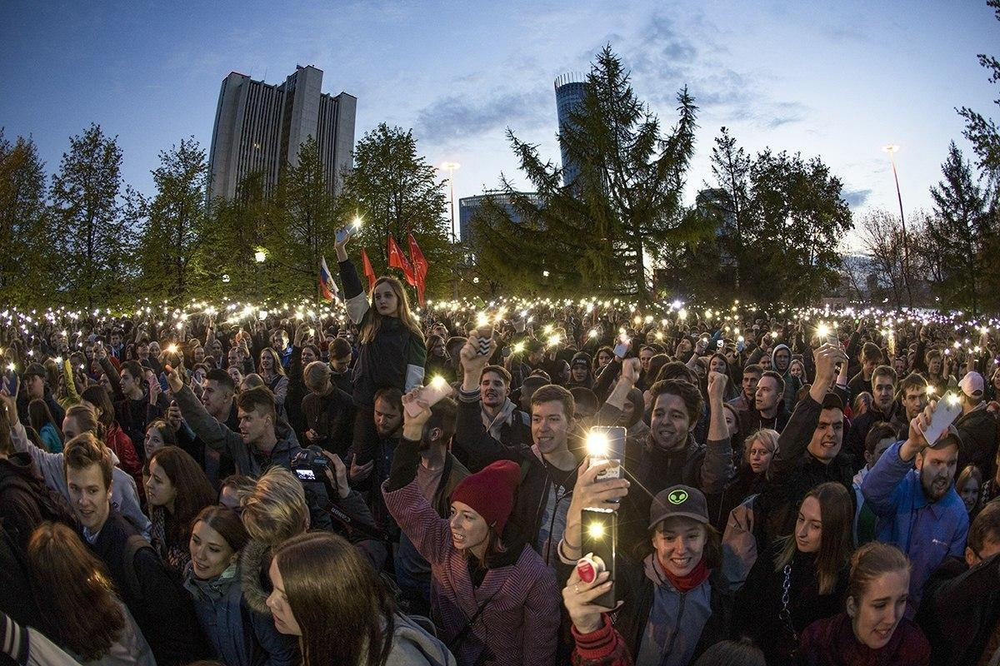

---
    date: 2020-04-30T12:00:00+05:00
...

# Остановим [ужесточение «антиэкстремистского» законодательства]!

Сейчас опубликован и готовится к обсуждению Указ "О внесении изменений в Стратегию противодействия экстремизму в Российской Федерации до 2025 года".

Цитаты из текста:

*«11. Наиболее опасные виды экстремизма проявляются в возбуждении ненависти либо вражды по признакам ..., в том числе путем распространения призывов к насильственным действиям, прежде всего через информационно-телекоммуникационные сети, включая сеть «Интернет» ...»;*

*«13. В современных социально-политических условиях крайним проявлением экстремизма является терроризм, который основывается на экстремистской идеологии. Эта угроза будет сохраняться до тех пор, пока существуют источники и каналы ее распространения.»;*

*«16. Одним из основных способов дестабилизации общественно-политической и социально-экономической обстановки в Российской Федерации становится привлечение различных групп населения к участию в несогласованных публичных мероприятиях (в том числе протестных акциях), которые умышленно трансформируются в массовые беспорядки.»;*

*«22. Дестабилизирующее влияние на ситуацию оказывает деятельность отдельных зарубежных организаций и подконтрольных им российских объединений, в частности, под видом гуманитарных, образовательных, культурных, национальных и религиозных проектов, инспирирование протестной активности населения с использованием социально-экономических, экологических и других факторов.»;*

а ещё указаны Целевые показатели реализации настоящей Стратегии и Ожидаемые результаты реализации настоящей Стратегии.

Напоминаем вам, что этим фотографиям чуть меньше года. По мнению составителей приказа, всё произошедшее - это «экстремизм», организованный через интернет зарубежными и им подконтрольными российскими объединениями с использованием экологического фактора. 

Мы не можем остановить бешеный принтер щелчком пальцев, но в наших силах потратить пять минут, чтобы снизить вероятность принятия данного документа. Для этого:

* Зарегистрируйтесь на [сайте](https://regulation.gov.ru/). 
* Перейдите на [страницу законопроекта](https://regulation.gov.ru/projects#npa=100622). Текст можно скачать и ознакомиться в подробностях. Текст Стратегии, в который вносятся правки, читайте [по ссылке](https://legalacts.ru/doc/strategija-protivodeistvija-ekstremizmu-v-rossiiskoi-federatsii-do/).
* Поставьте оценку проекту. Для этого в верхней панели слева есть кнопки "лайк" и "дизлайк".