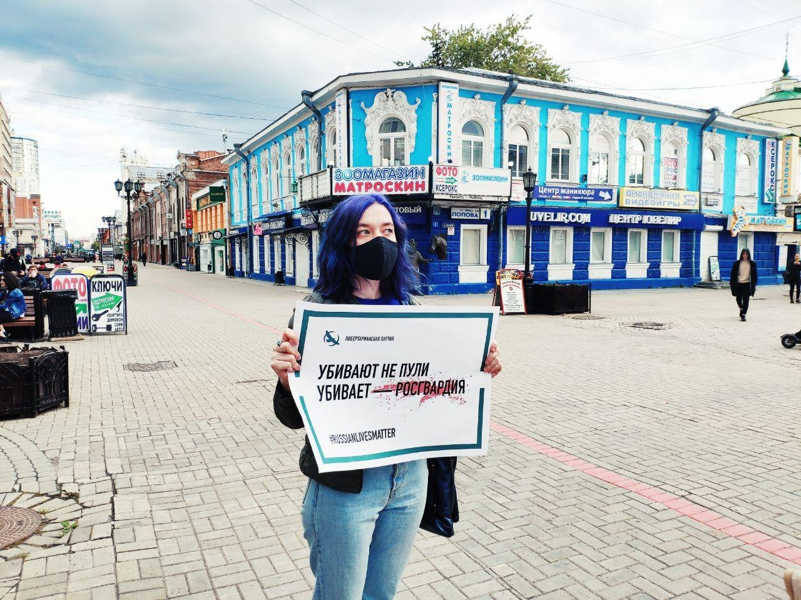
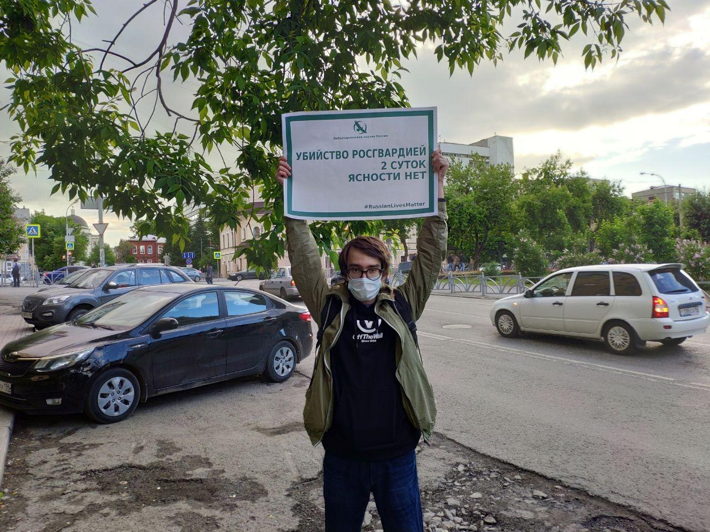

---
    date: 2020-06-02T12:00:00+05:00
...
# ЛПР [требует ответа] от Росгвардии, чьи сотрудники убили человека за кражу

Два дня назад в Екатеринбурге без суда и следствия росгвардейцы застрелили человека в его доме за «кражу обоев» и применение газового баллончика. Убийство до сих пор не было объяснено, а замалчивание породило новую волну протестов против полицейского произвола, подробнее о котором можно прочесть в [этом треде](https://twitter.com/chinarov96/status/1267593348250034177). 

Замалчивание и насилие не допустимы, поэтому мы вышли в одиночные пикеты с требованием показать видеозапись штурма квартиры убитого и ответить на вопросы общественности.

