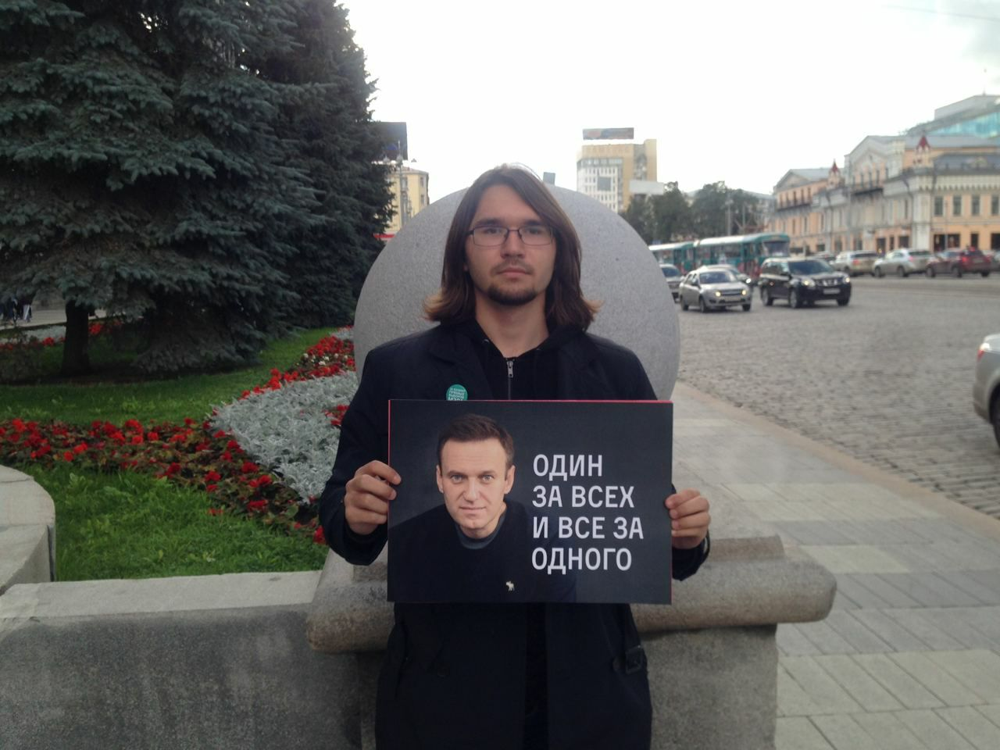
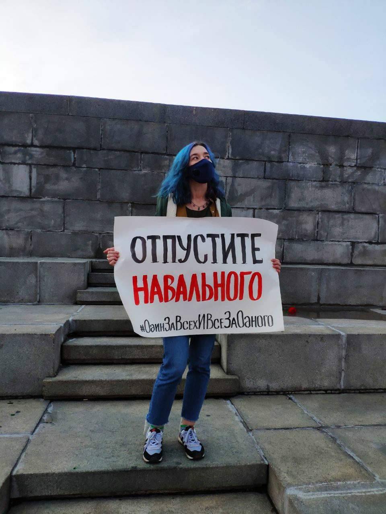

---
    date: 2020-08-21T22:17:03+00:00
...

# Активисты ЛПР [приняли участие] в пикетах в защиту Алексея Навального

Сегодня члены нашей партии Егор Васильченко и Дарья Котлярова приняли участие в серии одиночных пикетов в поддержку Алексея Навального.

Накануне Навальный попал в омскую больницу после того, как ему стало плохо на борту самолёта. Новость об отравлении известного оппозиционного политика прогремела в мировых СМИ. В больницу согнали кучу полиции и спецслужб, при этом врачи отказывались пустить жену Навального в палату без согласия Алексея, находившегося в коме. Экстренно прибывший самолёт с утра дожидался, пока врачи, объявляя противоречивые диагнозы, наконец разрешат транспортировать Навального в немецкую клинику.

В ситуации, когда промедление с установлением яда и оказанием помощи угрожает жизни человека, каждая минута проволочки превращается в мучительную пытку или казнь. Заказной и политический характер покушения не вызывает особых сомнений. Самое срочное и самое человеческое решение — отпустить Алексея туда, где врачи готовы оказать ему помощь и попытаются спасти ему жизнь.

Именно с этим призывом — «отпустите Навального» — вышла на пикет Дарья. Егор встал на площади с плакатом «Путин боится Навального»: только этим и можно объяснить происходящее. Вероятно, спецслужбам важнее, чтобы никто не разгадал использованные яды, чем то, выживет человек или нет.

Либертарианцы и сторонники Навального сегодня выходили с протестом по всей России. К вечеру прошла новость, что Навального наконец отпустят на лечение в Германию. Помните, что протест даёт результат и является гражданским долгом, тем более, когда речь идёт о человеческой жизни.

\#НавальныйЖиви \#ОдинЗаВсехИВсеЗаОдного