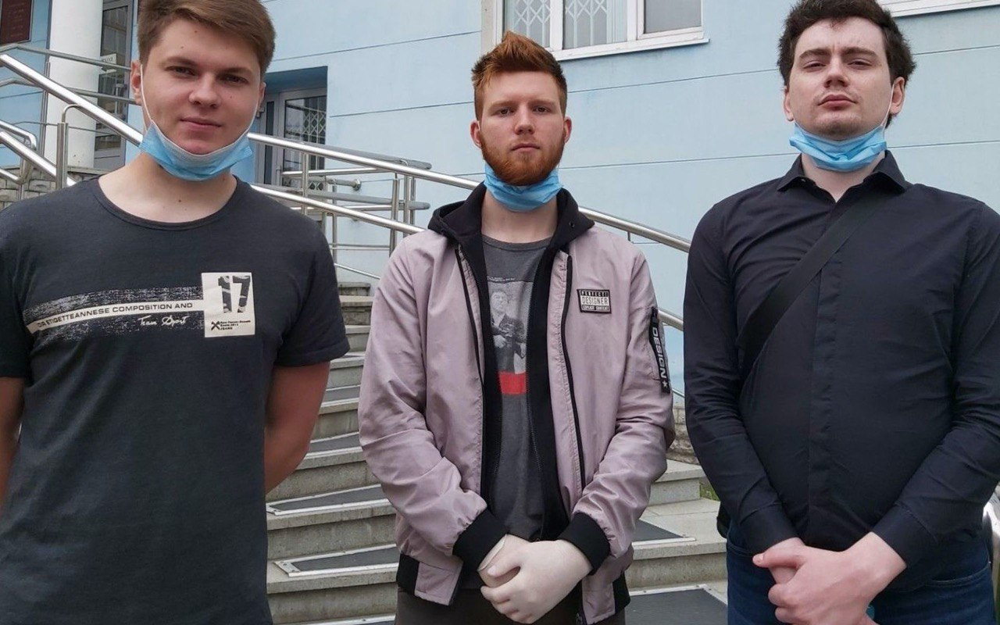
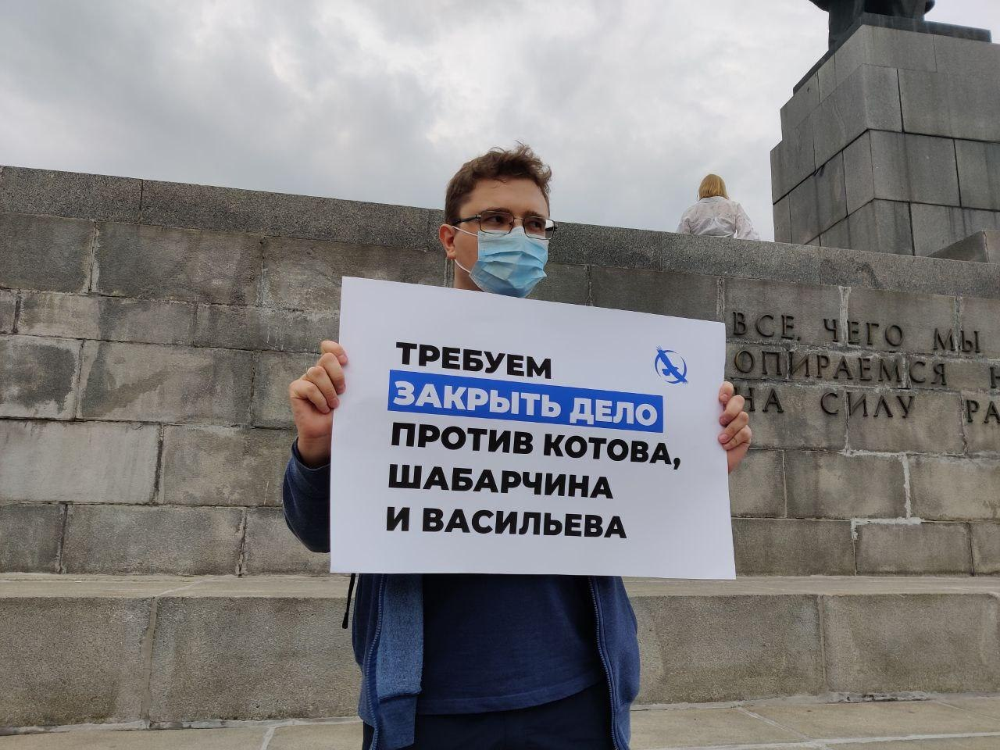
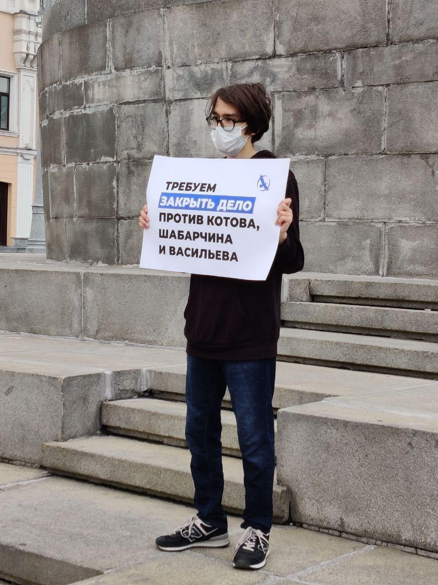
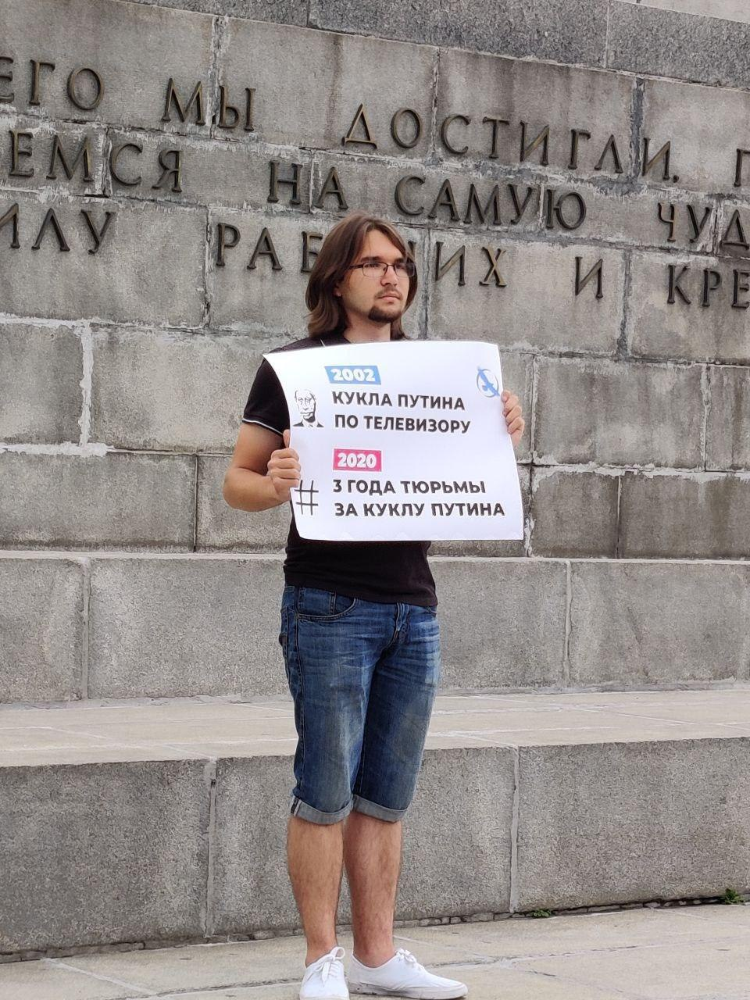

---
    date: 2020-08-09T19:12:24+00:00
...

# «Кукольное дело» [движется] к завершению

Развязка близка. На позавчерашнем заседании суда за привязанный к столбу манекен с картонным лицом Путина прокурор Быкова запросила следующие сроки обвиняемым:

* Шабарчин — 3 года колонии общего режима.
* Эткин — 2 года колонии общего режима.
* Васильев — 1 год и 6 месяцев общего режима.

Приговор будет объявлен на следующем заседании — 18 августа. Хочется верить в лучшее, но не будем себя обманывать — самый честный и справедливый суд в мире, почти никогда не выносит оправдательных решений, особенно по политическим делам. Нет никаких сомнений, что оно сфабриковано с целью запугивания гражданских активистов и подавления протестной активности. 

Напоминаем, что обвиняемые: **Шабарчин** и **Васильев** авторы канал [«Проект гроза»](https://www.youtube.com/channel/UC7ye2tIzkgQnxoXhjcaHjBw) (ранее Гроза Перми), а **Александр** **Эткин** **(Котов)** — член Пермского [отделения ЛПР](https://t.me/lpr_perm). 

Вчера активисты нашего отделения вышли в одиночные пикеты, чтобы поддержать фигурантов дела. 

Все подробности и оперативные новости по вы можете узнавать [в этом телеграм канале](https://t.me/chuchelo59).

Пикеты активистов Свердловского отделения ЛПР в поддержку фигурантов "кукольного" дела

\#кукланепреступление

