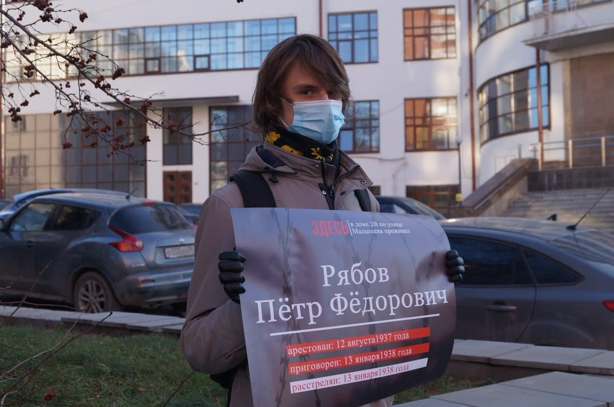
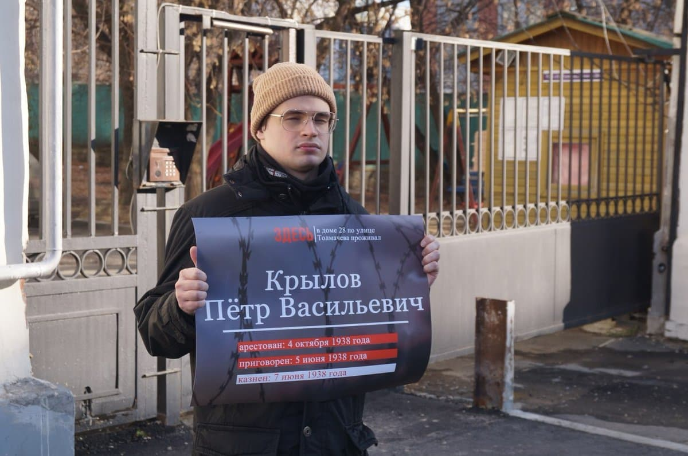
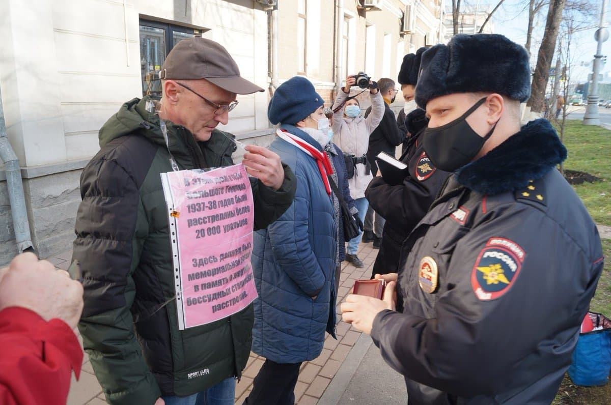
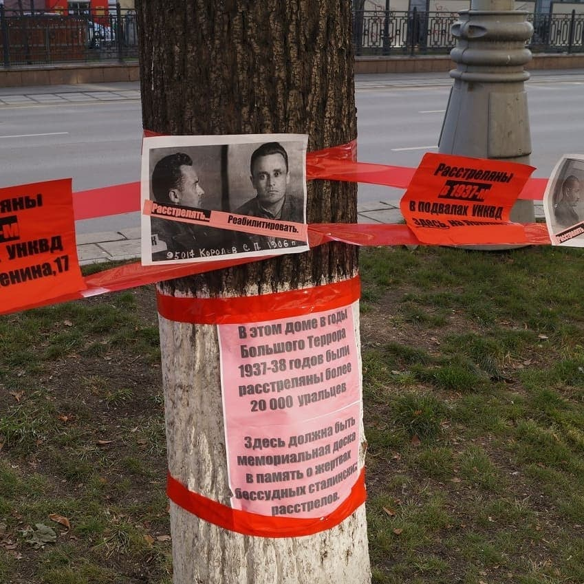

---
    date: 2020-10-31T13:36:53+00:00
...

# Активисты ЛПР [почтили память] жертв политических репрессий

Вчера 30-ого октября, прошел **день памяти жертв политических репрессий**. По всей стране люди отдавали дань тем, чья жизнь была искалечена или оборвана государством.

* Члены нашего отделения принимали участие в акции общества Мемориал у здания на улице Ленина 17, где расстреливали приговорённых к смерти. Были небольшие [проблемы с полицией](https://www.youtube.com/watch?v=HUQ_mlkcgug&feature=youtu.be), но всё обошлось. 

* В рамках акции [Бессмертный ГУЛАГ](https://t.me/vesna_democrat/18) мы выходили в пикеты у зданий, где проживали наши соотечественники, чья жизнь оборвалась по прихоти репрессивной государственной машины. Мы стояли у домов по адресу Толмачева 28 и Малышева 2Б.

