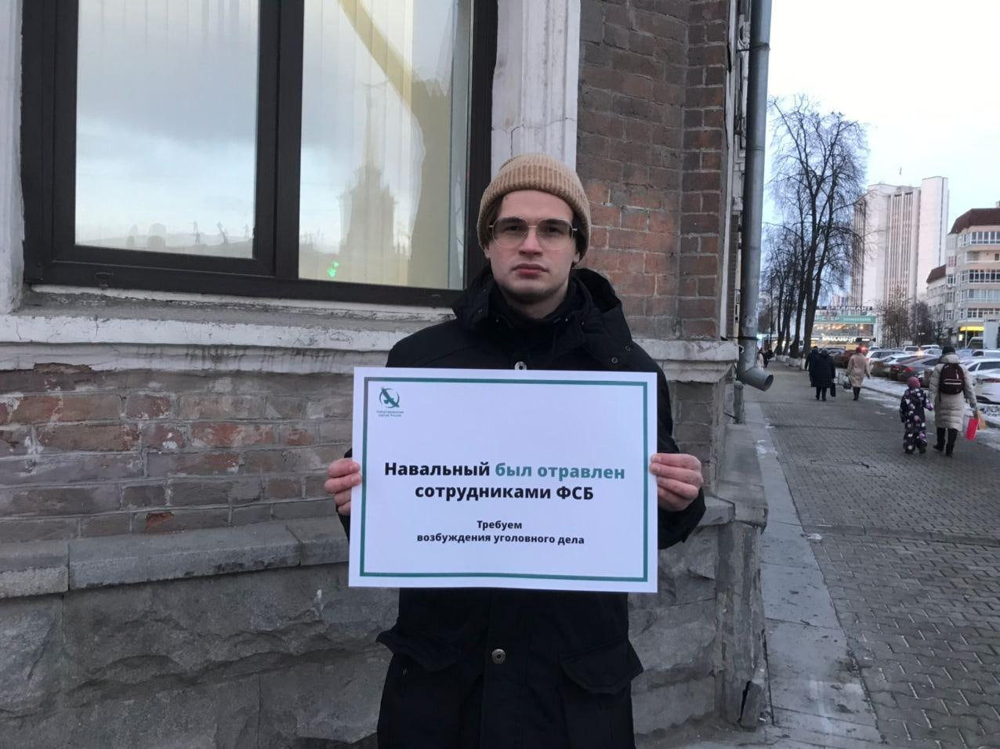
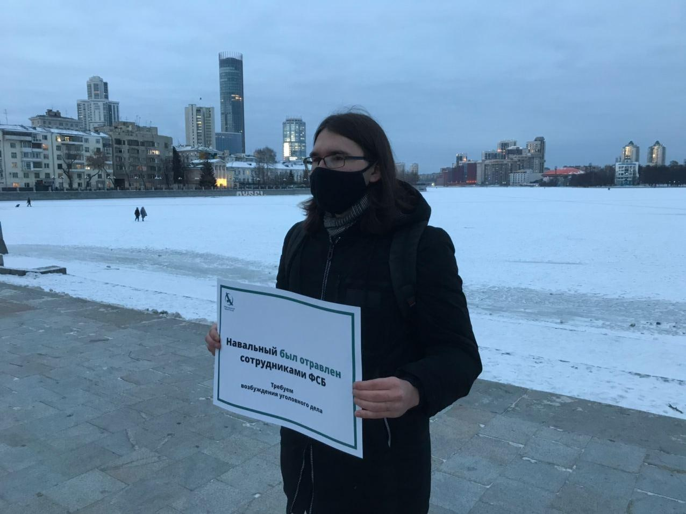
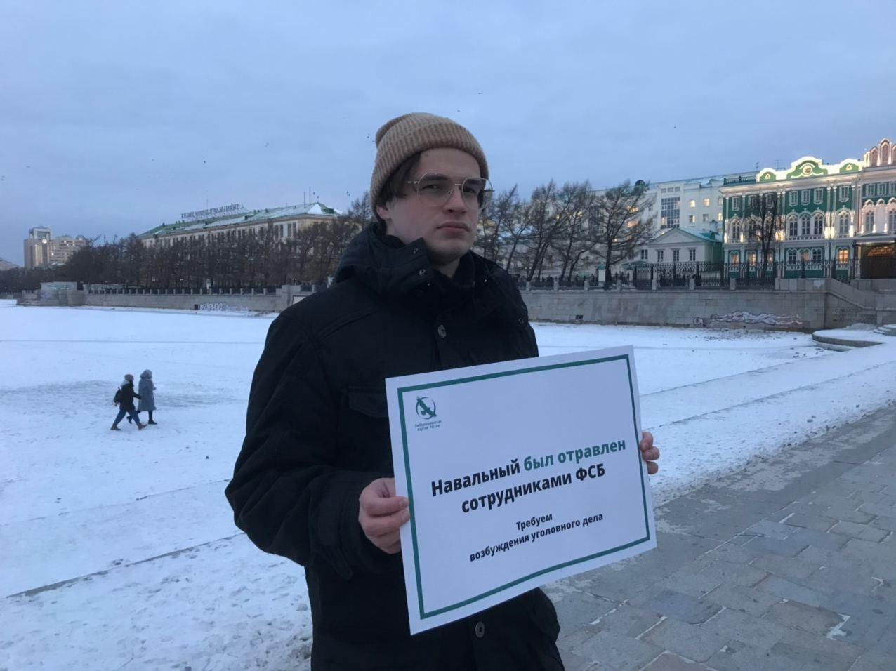

---
    date: 2020-12-17T18:01:08+00:00
...

# Активисты ЛПР [потребовали возбудить] уголовное дело о покушении на Алексея Навального

Два дня назад на канале Алексея Навального вышло видео с расследованием, которое придало еще больше уверенности тому, что уже несколько месяцев и так обсуждалось всеми политиками и активистами нашей страны. 20 августа 2020 года, самый известный оппозиционный политик России, как утверждается в расследовании, был отравлен сотрудниками ФСБ. 

Для многих членов либертарианской партии это заявление не было большим сюрпризом, однако столь основательное подтверждение факта попытки политического убийства своего оппонента нашей властью все же не может не вызвать серьезных опасений у любого активиста и просто человека, интересующегося политикой. 

Еще более пугающий оттенок этой ситуации придает тот факт, что власть сломала еще один негласный барьер. Если раньше была надежда на то, что столь известных как Алексей политиков защищает сама их популярность и медийная поддержка, то теперь нам однозначно продемонстрирована ложность подобных размышлений. Местных активистов убивают их родные мэры, губернаторы и служащие им полицейские. А вот на общероссийском уровне о вас позаботиться сам президент.

Но если наше государство думало, что сможет запугать людей подобными террористическими методами и отвадить их от занятия политикой, то оно глубоко заблуждается. Члены Либертарианской Партии России продолжат свою деятельность, как и многие другие люди, вместе с нами стремящийся реализовать светлую мечту о Свободной России Будущего. И, в связи с этим, мы выражаем искреннюю надежду, что государственный террор станет поводом для объединения людей. Вступления или организации партии, общественной организации или любого другого движения. Ведь это не только способно сделать вашу жизнь безопаснее, но и покажет убийцам в погонах, что так просто запугать собственный народ у них не получится.

[Расследование Навального](https://www.youtube.com/watch?v=smhi6jts97I)

Сегодня члены Свердловского отделения ЛПР вышли в одиночные пикеты, чтобы привлечь внимание жителей Екатеринбурга к расследованию Алексея Навального и потребовать от властей возбуждения уголовного дела в связи с его отравлением.

