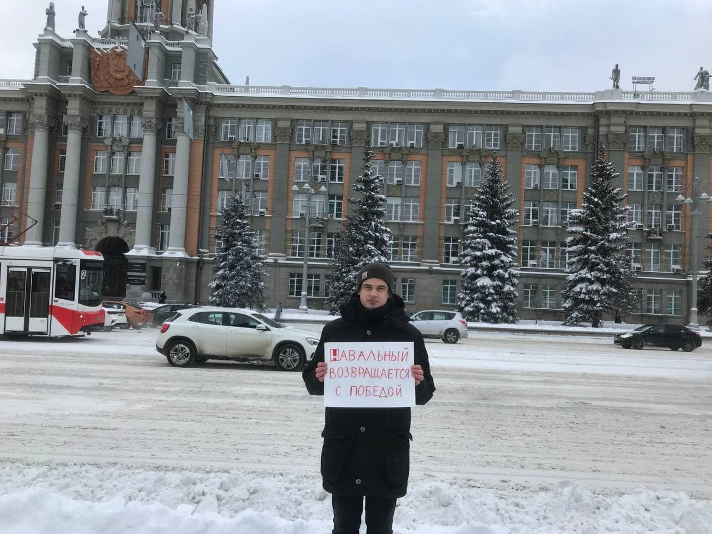

---
    date: 2021-01-17T01:42:21+00:00
...

# Активист ЛПР [вышел в пикет] в поддержку Навального

Завтра в 19:20 по Московскому времени, после прохождения лечения в Берлинской клинике, Алексей Навальный возвращается обратно в Россию. Скорее всего, его арестует прямо в аэропорту или в течение первых дней пребывания на Родине. ФСИН потребовала заменить условный срок на реальный, а позже стало известно, что Навальный был объявлен в федеральный розыск. Не получилось убить – попытаются посадить. Угрозы уголовного преследования по сфабрикованному делу – это попытка заставить Алексея изменить решение и остаться в политической эмиграции.

Член нашего отделения Матвей Голованов вышел в одиночный пикет в центре Екатеринбурга, чтобы поддержать Алексея Навального.
