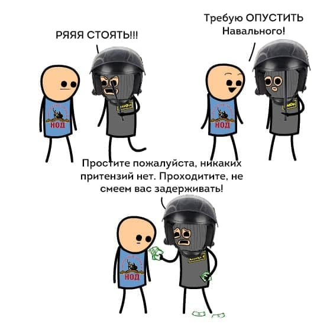

---
    date: 2021-02-16T19:27:16+00:00
...

# Государство [выборочно применяет законы] о митингах

Помимо оппозиционно настроенных мирных граждан 31ого января в Екатеринбурге [задержали](https://t.me/znak_ekb/8531) и одного НОДовца, который тоже мирно вышел выразить свое мнение. У некоторых людей, включая автора, могло возникнуть впечатление некой принципиальности охранителей. Сказано, что разгоним, — значит разгоним всех!

Однако, суд [прекратил](https://t.me/znak_ekb/8554) дело в отношении представителя НОД, а вот других задержанных за аналогичное "правонарушение" (выход на мирный митинг с плакатом) уважаемая власть все-таки подвергла репрессивным взысканиям. 

Какое доверие к официальным государственным институтам вообще может быть после этого? Вопрос скорее риторический, на который каждый сможет ответить себе сам.
