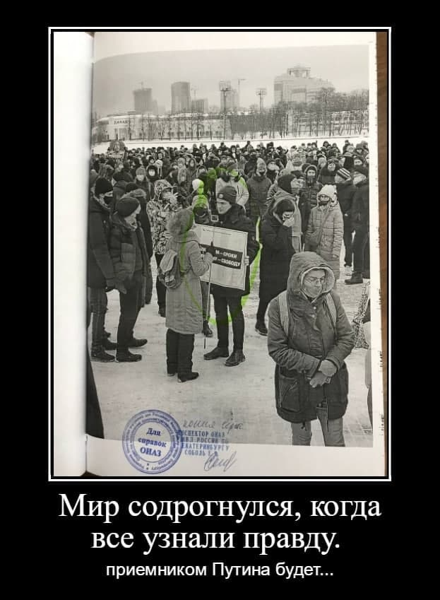

---
    date: 2021-02-24T21:29:52+00:00
...

# Либертарианца [приговорили к работам] за участие в шествии

Недавно состоялось заседание Верх-Исетсткого суда, на котором Матвею Голованову, члену нашего отделения, назначили 30 часов обязательных работ за участие в шествии 31 января (по 20.2 часть 5).

Это новая для Екатеринбурга практика. Раньше такая мера воздействия на участников протестных акций не применялась. Видимо, власти решили, что  оппозиция хорошо научилась собирать деньги на штрафы. Может быть, дело в чём-то другом. 

Например, вам не кажется, что так плохо, как в этом году, наши улицы от снега не убирали уже очень давно?