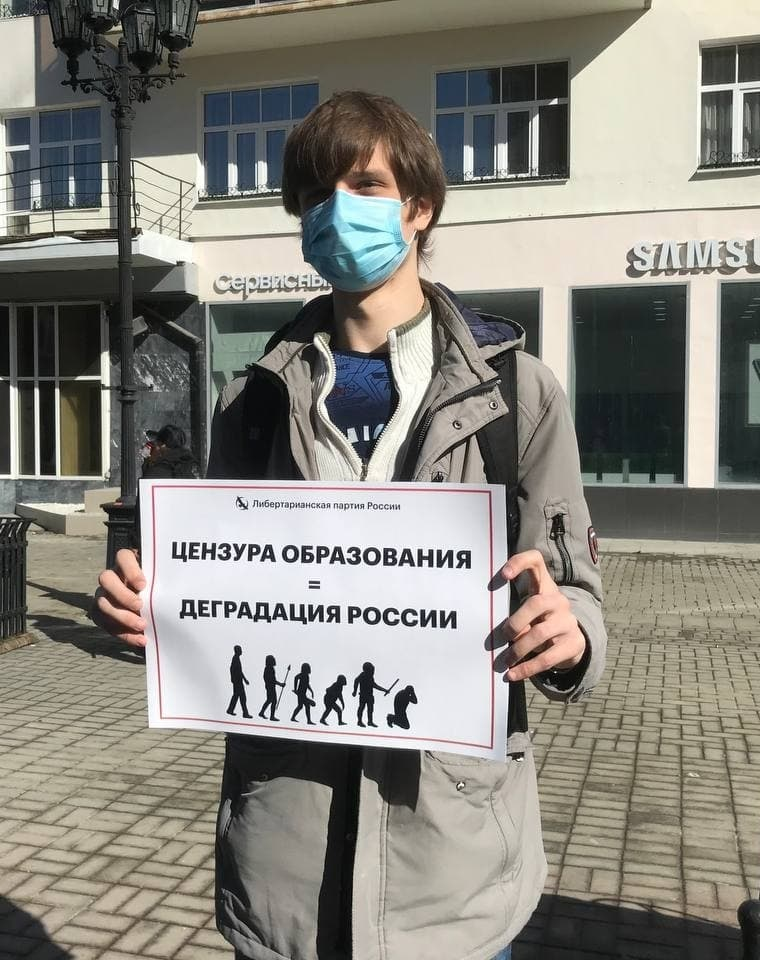
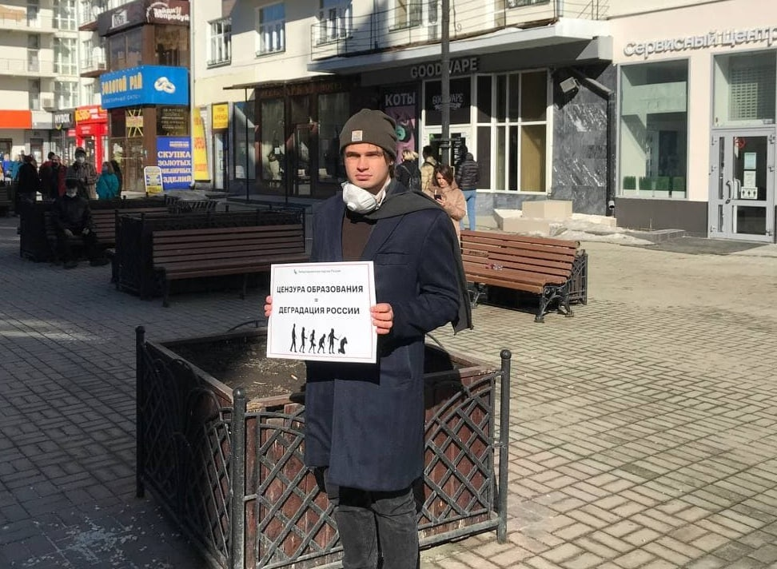

---
    date: 2021-03-27T16:56:17+00:00
...

# Либертарианцы [провели пикеты] против госрегулирования просвещения

Сегодня в Екатеринбурге члены Либертарианской партии России — **Матвей Голованов** и **Ксель Иван** выходили в одиночные пикеты против государственного контроля над просветительской деятельностью. Печальный и стыдный законопроект прошёл третье чтение в гос. думе и уже с 1 июня вступает в силу.

Федеральный комитет ЛПР недавно опубликовал [заявление](https://t.me/lpr_tg/5077) с развёрнутой позицией партии по данному законопроекту.

Вы по-прежнему можете подписать петицию на [Change.org](https://www.change.org/p/%D0%B3%D0%BE%D1%81%D1%83%D0%B4%D0%B0%D1%80%D1%81%D1%82%D0%B2%D0%B5%D0%BD%D0%BD%D0%B0%D1%8F-%D0%B4%D1%83%D0%BC%D0%B0-%D1%80%D1%84-%D0%BF%D1%80%D0%BE%D1%82%D0%B8%D0%B2-%D0%BF%D0%BE%D0%BF%D1%80%D0%B0%D0%B2%D0%BE%D0%BA-%D0%BE-%D0%BF%D1%80%D0%BE%D1%81%D0%B2%D0%B5%D1%82%D0%B8%D1%82%D0%B5%D0%BB%D1%8C%D1%81%D0%BA%D0%BE%D0%B9-%D0%B4%D0%B5%D1%8F%D1%82%D0%B5%D0%BB%D1%8C%D0%BD%D0%BE%D1%81%D1%82%D0%B8-1e6d7a97-a61a-49b9-a7a7-80da49172ccf?source_location=discover_feed) против данного законопроекта, которую к настоящем моменту поддержали уже более 240.000 человек. Это то немногое, что под силу сделать буквально каждому

