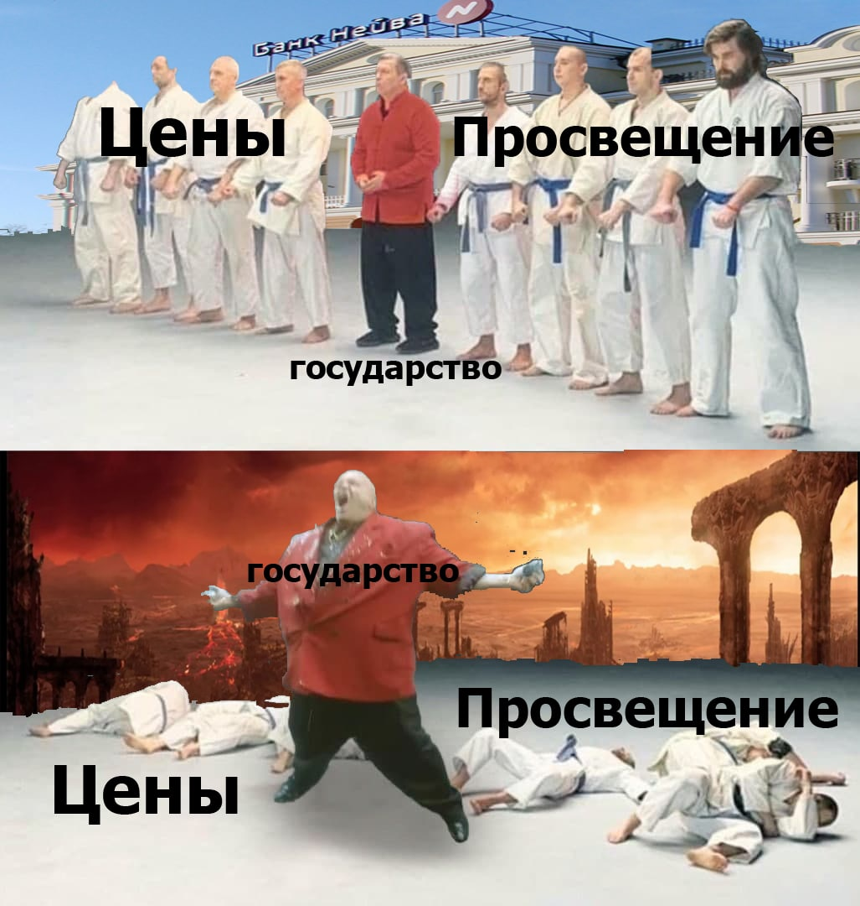

---
    date: 2021-04-24T14:12:20+00:00
...

# Государство [отняло лицензию] у частного уральского банка

Утром 16 апреля, без объявления войны Банк России отозвал лицензию у старейшего уральского банка «Нейва». Многим путешественникам он известен благодаря лучшему на условию по обмену валюты. Ликвидировав его, государство  незаметно так или иначе сделало беднее каждого из нас, но некоторые пострадали от его действий особенно сильно.

Ведь одним приказом Банк России:

* лишил работы несколько сотен сотрудников «Нейвы» и отжал бизнес  успешных учредителей банка, как гопник в темном переулке. 
* на неопределенный срок заморозил деньги тысяч людей на счетах.  Пострадали простые граждане, которые уже привыкли пользоваться карточками и не снимали наличных; пострадали предприниматели, лишившиеся оборотных средств и возможности вести бизнес. 

И за эти потери никто не будет отвечать. Делай, что хочешь, теряй сколько угодно денег. Государству всё равно, ты абсолютно никак не защищен перед ним.

Оно делает это, потому что может.  Может закрыть любой неугодный банк с расплывчатыми формулировками, как проделывало это уже не один [раз](https://ru.wikipedia.org/wiki/%D0%A1%D0%BF%D0%B8%D1%81%D0%BE%D0%BA_%D0%B1%D0%B0%D0%BD%D0%BA%D0%BE%D0%B2,_%D0%BB%D0%B8%D1%88%D1%91%D0%BD%D0%BD%D1%8B%D1%85_%D0%BB%D0%B8%D1%86%D0%B5%D0%BD%D0%B7%D0%B8%D0%B8_%D0%B2_2020_%D0%B3%D0%BE%D0%B4%D1%83_(%D0%A0%D0%BE%D1%81%D1%81%D0%B8%D1%8F)). Может вместе с этим заморозить всю твою финансовую деятельность и заставить нести в связи с этим убытки. А может просто оставить тебя без денег на несколько недель, пока ты будешь ждать возвращения вкладов из закрытого им банка. Председатель правления «Нейвы» Левушкин, [говоря](https://ria.ru/20210416/litsenziya-1728551703.html) о возможных причинах этого решения, называет текущую геополитическую ситуацию и связь закрытия банка с активной торговлей долларами через него. Заместитель председателя правления Павел Ефремов [высказывает](https://66.ru/bank/news/240116/) иную точку зрения. 

Закрытие «Нейвы» — очередная наглядная иллюстрация того, насколько уважительно к частной собственности относится государство. От него можно ждать чего угодно, например  в удобное время после выборов могут принять закон, по которому вклады граждан после отзыва лицензий частных банков будут переходить в собственность государству. Конечно, в нем будет указано, что о закрытии вкладчики должны быть заранее предупреждены. Где-нибудь за день до выходных на никому не нужном сайте Банка России в самом низу раздела «Новости». И поступать оно может так из-за абсолютной уверенности в собственной безнаказанности. А что? Главное к новым выборам еще раз пообещать бесплатные обеды.

Мы рекомендуем стараться не уповать на благожелательность государства, уже в который раз грабящего собственный народ и повышать свою финансовую грамотность, изучая все возможные способы защиты своих активов от загребущих лап номенклатуры, в том числе через активное участие в политической жизни страны.

