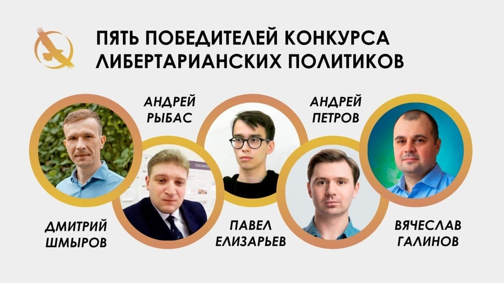

---
    date: 2021-04-15T11:29:03+00:00
...

# Либертарианец из Екатеринбурга [победил в конкурсе] либертарианских политиков

В конкурсе [либертарианских политиков](https://t.me/lpr_tg/5101) одним из победителей стал член руководящего комитета Свердловского отделения ЛПР **Павел Елизарьев**. Это означает, что на предстоящих выборах он и его команда могут рассчитывать на приоритетную поддержку со стороны партийной Федеральной Политической Рабочей Группы (ФПРГ).

*Мы поздравляем Павла с этим достижением и желаем ему успехов на предстоящих выборах!*
