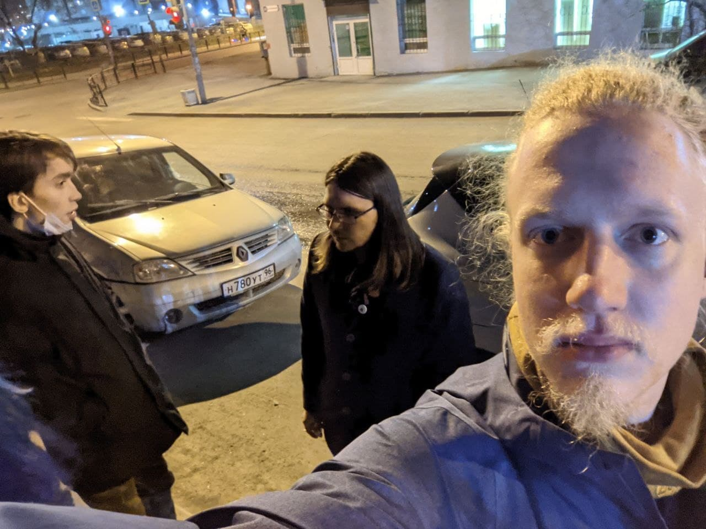

---
    date: 2021-04-22T11:02:52+00:00
...

# У активиста ЛПР [прошёл обыск] по делу о массовых беспорядках

Вчера к члену нашего отделения Егору Васильченко пришла полиция с обыском по адресу регистрации, где живут его родители.

Сегодня Егор весь вечер провёл на допросе в Следственном Комитете на Щорса 18. Ночью его отпустили, но очередной допрос будет сегодня в 15.00. Пока Егор проходит в качестве свидетеля. В чём суть дела, не говорят.

**Upd**: В Екатеринбурге [возбуждено уголовное дело](https://t.me/apologia/3655) о призывах к массовым беспорядкам (ч.3 ст. 212 УК РФ).