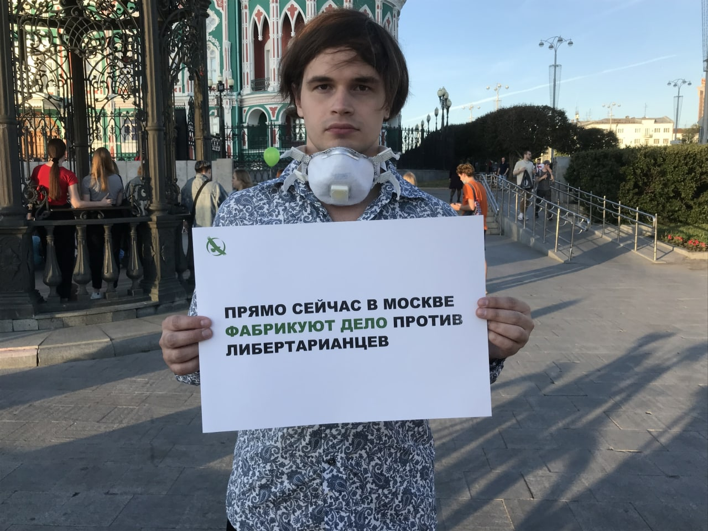

---
    date: 2021-05-29T12:15:40+00:00
...

# Либертарианцы Екатеринбурга [поддержали] преследуемых коллег из Москвы и Красноярска

Пикет в поддержку либертарианцев Москвы и Красноярска

В минувший четверг прошла [серия обысков и допросов](https://t.me/lpr_tg/5165) либертарианцев по, так называемому "Дорожному делу". Обыски с последовавшим задержанием для допроса были у **Игоря Ефремова**, **Антона Овчарова**, **Всеволода Осипова** и **Александра Разина**. Также полицейские провели обыски у **Александра Гуда**, **Ильи Даниленко**, **Ивана Чинарова** и **Глеба Марьясова**.

В знак поддержки и солидарности с коллегами, в одиночный пикет в центре Екатеринбурга вышел член Свердловского отделения ЛПР, **Матвей Голованов**.
