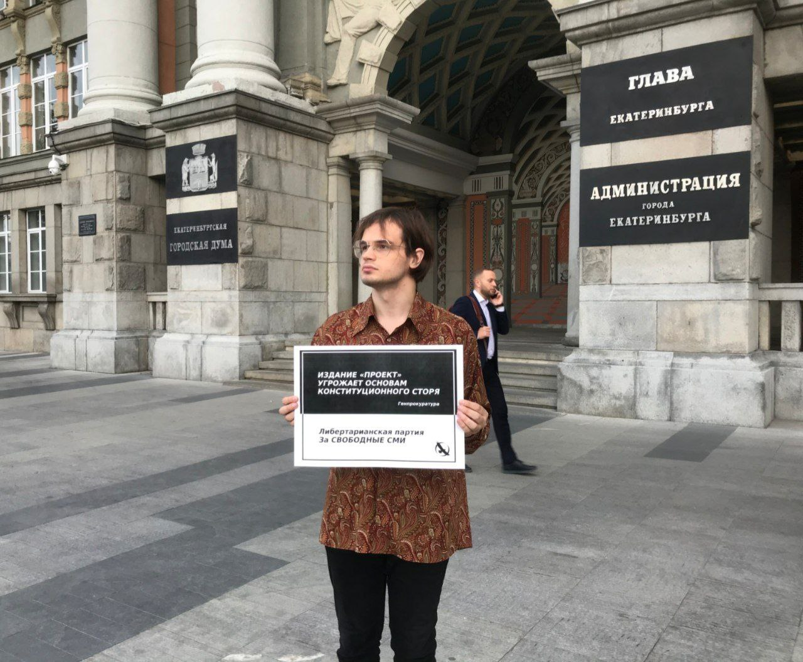
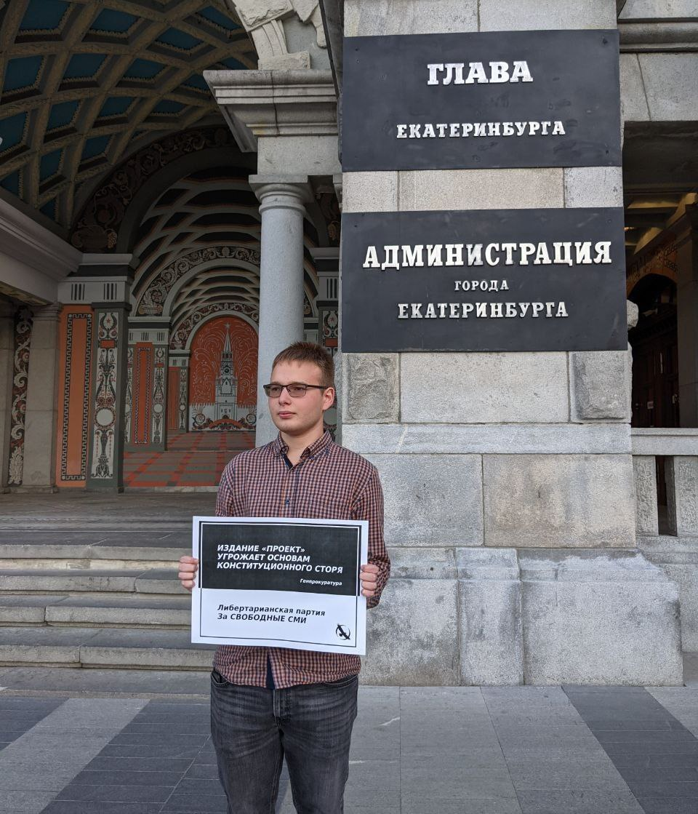
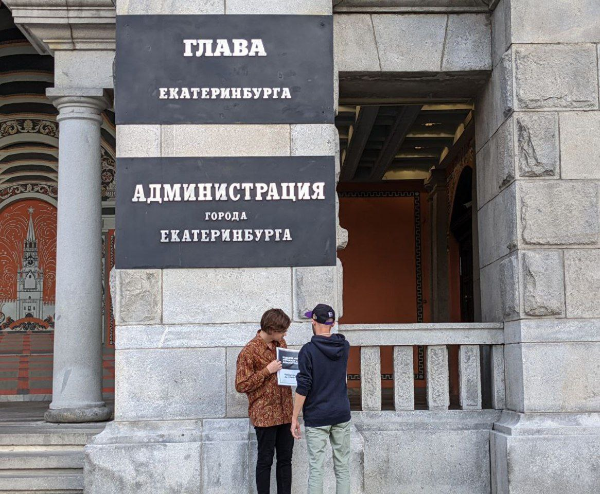
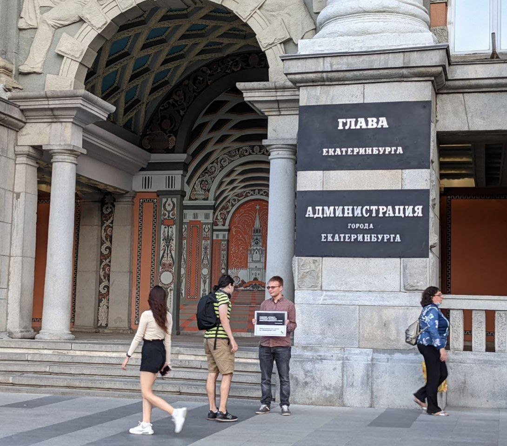

---
    date: 2021-07-16T21:44:30+00:00
...

# Либертарианцы [провели пикеты] против преследования издания Проект

15 июля Генпрокуратура РФ признала интернет-издание Проект нежелательной организацией.

Издание занималось расследованием коррупции, касавшейся первых лиц государства. Для избежания следующих за этим статусом уголовных дел и посадки журналистов, [его пришлось закрыть](https://www.znak.com/2021-07-16/izdanie_proekt_obyavilo_o_zakrytii_posle_priznaniya_nezhelatelnoe_organizaciey). 

Члены нашего отделения *Матвей Голованов* и *Сергей Аблеев* вышли в пикет возле здания администрации Екатеринбурга, чтоб поддержать журналистов. Сотрудники администрации не препятствовали пикету.

