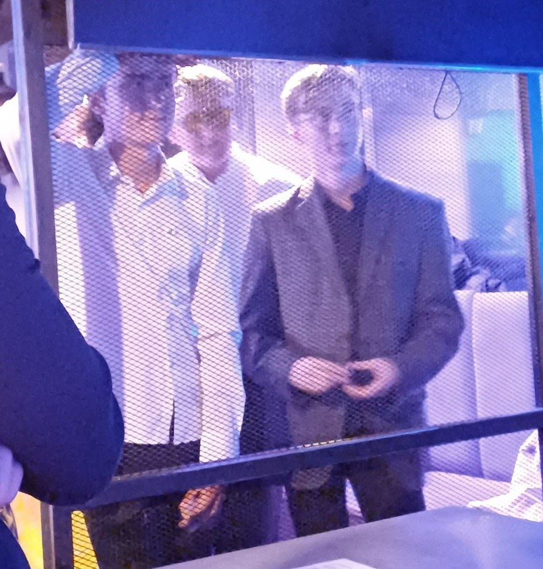

---
    date: 2024-09-09T18:00:00+00:00
...

# Либертарианцы [приняли участие] в полуфинале Лиги дебатов

Вчера прошёл полуфинал [Лиги дебатов](https://t.me/ligadebatovekb) на тему "Легализация игорного бизнеса: шанс для развития туризма, или источник социальных проблем?".

Наша команда "Бостонский чай" выступила в защиту игорного бизнеса. Противниками был "Блок Я" — команда [Молодёжного яблока](https://t.me/YouthYabloko66). К сожалению, на данном этапе мы выбываем из турнира. 

Благодарим организаторов за это интересное мероприятие, надеемся ещё принять участие в последующих сезонах, а нашим оппонентам желаем интересного финала.

Тем не менее, обозначим что мы не согласны с решением жюри игры и обоснованно полагаем его предвзятым и не объективным. В конце они значительное время потратили на то, чтобы разъяснить зрителям, что: "либертарианство есть несостоятельная идеология неандертальцев", а при подсчёте организаторами зрительских голосов обнаружился подавляющий перевес в нашу пользу.

В жаре дискуссии и при плохом освещении мало кто сумел сделать хорошие фото. Для правой половины зала мы находились за решеткой.

